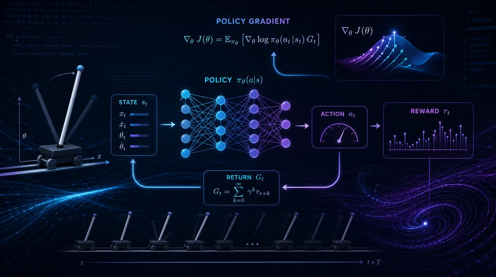

<div align="center">
  

# [CS115] Policy Gradient for Reinforcement Learning — Nhóm 05

**Đồ án Môn học — Toán cho Khoa học Máy tính (CS115)**  
 _Đề tài: Khám phá nền tảng toán học và triển khai thực tiễn thuật toán REINFORCE trên bài toán CartPole-v1._

[](https://www.python.org/)
[](https://pytorch.org/)
[](https://gymnasium.farama.org/)
[](https://www.uit.edu.vn/)
[](https://www.uit.edu.vn/)

</div>

<br/>

## Mục lục

- [Thông tin Môn học](#thông-tin-môn-học)
- [Mục tiêu Đồ án](#mục-tiêu-đồ-án)
- [Công nghệ sử dụng](#công-nghệ-sử-dụng)
- [Cấu trúc Dự án](#cấu-trúc-dự-án)
- [Hướng dẫn Khởi chạy](#hướng-dẫn-khởi-chạy)
- [Chi tiết Học thuật](#chi-tiết-học-thuật)
  - [Lộ trình & Tiến độ](#lộ-trình--tiến-độ)
  - [Nền tảng Toán học](#nền-tảng-toán-học)
  - [Phân chia Công việc (WBS)](#phân-chia-công-việc-wbs)
  - [Điều lệ Nhóm](#điều-lệ-nhóm)
  - [Báo cáo & Nộp bài](#báo-cáo--nộp-bài)

---

## Thông tin Môn học

- **Môn học:** CS115 — Toán cho Khoa học Máy tính
- **Cơ sở:** Trường Đại học Công nghệ Thông tin (UIT), Đại học Quốc gia Thành phố Hồ Chí Minh (VNU-HCM)
- **Giảng viên:** TS. Dương Việt Hằng (<hangdv@hcmuit.edu.vn>) — KHMT, UIT
- **Học kỳ:** 2025–2026 (Học kỳ 2)

## Mục tiêu Đồ án

Đồ án trình bày nền tảng lý thuyết và triển khai thực tiễn của **phương pháp Policy Gradient** trong Học tăng cường (Reinforcement Learning). Cụ thể, nhóm triển khai thuật toán **REINFORCE** để giải quyết bài toán điều khiển cổ điển `CartPole-v1` thông qua `PyTorch` và `Gymnasium`.

**Kết quả Học tập (Learning Outcomes):**

1. Chứng minh Định lý Policy Gradient từ các nguyên lý cơ bản.
2. Xây dựng mạng chính sách ngẫu nhiên (stochastic policy network) và huấn luyện bằng phương pháp Monte-Carlo.
3. Phân tích hành vi hội tụ và trực quan hóa đường cong học tập.
4. Tài liệu hóa toàn bộ quy trình theo tiêu chuẩn kỹ thuật phần mềm học thuật.

> **Tài liệu đầy đủ** (thiết kế hệ thống, chứng minh toán học, quy trình làm việc nhóm):  
> Xem **[Báo cáo Thiết kế Dự án (PDR)](./docs/project-overview-pdr.md)**.

---

## Công nghệ sử dụng

| Danh mục             | Công nghệ                                                                                                                                                                                         |
| :------------------- | :------------------------------------------------------------------------------------------------------------------------------------------------------------------------------------------------ |
| **ML / RL Chính**    |                |
| **Toán & Trực quan** |                    |
| **Môi trường**       |   |

---

## Cấu trúc Dự án

```text
CS115-Team05-PG/
│
├── docs/                   # Tài liệu dự án (PDR, roadmap, architecture)
├── math/                   # Chứng minh toán học (LaTeX)
├── reports/                # Cập nhật tuần và ghi chú tiến độ public
├── scripts/                # Entrypoint CLI có thể chạy lại
│   ├── train.py            # Huấn luyện REINFORCE với seed/hyperparameters
│   ├── evaluate.py         # Đánh giá checkpoint chính sách đã lưu
│   ├── run_experiments.py  # Chạy grid hyperparameter nhỏ gọn
│   └── visualize.py        # Sinh figure dùng cho báo cáo
├── sources/                # Triển khai cốt lõi
│   ├── models/             # Mạng chính sách (PyTorch)
│   ├── train.py            # Logic vòng lặp huấn luyện
│   ├── test_env.py         # Kiểm tra môi trường
│   └── reinforce.py        # Cốt lõi thuật toán REINFORCE
│
└── outputs/                # Kết quả train/evaluate và figures có thể tái lập
```

> _Chi tiết phân công trách nhiệm theo module, xem [Quy trình làm việc Nhóm](./docs/project-overview-pdr.md)._

---

## Hướng dẫn Khởi chạy

### 1. Điều kiện tiên quyết

- **Python 3.9+**
- **Git**

### 2. Cài đặt

```bash
git clone https://github.com/uit-25730067-chithanh/CS115-Team05-PG.git
cd CS115-Team05-PG

# Tạo môi trường ảo (khuyến nghị)
python3 -m venv venv
source venv/bin/activate  # macOS/Linux
# hoặc
# .\venv\Scripts\activate  # Windows

# Cài đặt thư viện
pip install -r requirements.txt
```

### 3. Huấn luyện

Chạy entrypoint huấn luyện có thể tái lập:

```bash
python3 scripts/train.py --episodes 500 --seed 42 --hidden-dim 64
```

Trọng số chính sách, raw rewards, metrics và đường cong học tập sẽ được lưu trong thư mục con có gắn timestamp dưới `outputs/` (ví dụ: `outputs/run_YYYYMMDD_HHMMSS/`).

### 4. Đánh giá

Đánh giá checkpoint đã lưu:

```bash
python3 scripts/evaluate.py --checkpoint outputs/run_YYYYMMDD_HHMMSS/best_policy.pth --episodes 10 --hidden-dim <matching_hidden_dim>
```

`--hidden-dim` phải khớp cấu hình checkpoint trong `run_config.txt`. Ví dụ, run đầy đủ đang track tại `outputs/run_20260510_011946/` dùng `hidden_dim: 128`.

### 5. Kiểm tra Môi trường

Xác minh môi trường Gymnasium hoạt động đúng:

```bash
python3 sources/test_env.py
```

---

## Chi tiết Học thuật

> Các mục sau chứa các sản phẩm bắt buộc và siêu dữ liệu (metadata) cần thiết cho **đánh giá môn học** (CS115).

---

### Lộ trình & Tiến độ

Tính đến ngày 27/05/2026, phần triển khai chính, báo cáo cuối và slide thuyết trình đã hoàn thành. Phần còn lại là đóng gói nộp bài và dọn repo trước khi public.

| Giai đoạn | Nội dung chính                         | Trạng thái     |
| :-------- | :------------------------------------- | :------------- |
| **GĐ 1**  | Chứng minh Toán & Thiết lập môi trường | Hoàn thành     |
| **GĐ 2**  | Mạng Policy & REINFORCE                | Hoàn thành     |
| **GĐ 3**  | Huấn luyện, tuning & visualization     | Hoàn thành     |
| **GĐ 4**  | Báo cáo, slides & giải trình cuối      | Hoàn thành     |

Các mốc đã hoàn thành gồm baseline evaluation, PolicyNetwork, training REINFORCE, entrypoint train/evaluate có thể tái lập, hyperparameter tuning nhỏ gọn, visualization dùng cho báo cáo, báo cáo cuối và slide thuyết trình.

Xem biểu đồ Gantt chi tiết tại: **[docs/project-roadmap.md](./docs/project-roadmap.md)**

---

### Nền tảng Toán học

Tối ưu hóa phần thưởng kỳ vọng $J(\theta)$ bằng cách điều chỉnh tham số $\theta$ của chính sách ngẫu nhiên $\pi_\theta(a_t \mid s_t)$.

$$
\nabla_\theta J(\theta)
= \mathbb{E}_{\tau \sim \pi_\theta}
\left[
\sum_{t=0}^{T}\nabla_\theta \log \pi_\theta(a_t \mid s_t)G_t
\right]
$$

- **$\pi_\theta(a_t \mid s_t)$**: Xác suất thực hiện hành động $a_t$ tại trạng thái $s_t$.
- **$G_t$**: Reward-to-go, $G_t = \sum_{k=t}^{T}\gamma^{k-t}r_{k+1}$.
- **Thủ thuật Đạo hàm Log**: $\nabla_\theta f(\theta) = f(\theta)\nabla_\theta \log f(\theta)$.

> _Chứng minh đầy đủ, xem [Báo cáo Thiết kế Dự án (PDR)](./docs/project-overview-pdr.md)._

---

### Phân chia Công việc (WBS)

| Module       | Chủ trì            | Hỗ trợ         |
| :----------- | :----------------- | :------------- |
| **Toán học** | Hoàng Cao Sơn      | Đặng Chí Thanh |
| **Mã nguồn** | Đặng Chí Thanh     | Hoàng Cao Sơn  |
| **Báo cáo**  | Phạm Vũ Xuân Quỳnh | Đặng Chí Thanh |

---

### Điều lệ Nhóm

- **Giao tiếp**: MS Teams (chính) | Zalo (khẩn cấp).
- **SLA**: Phản hồi trong 12–24h. Giờ nghỉ: 23h–07h & 18h30–21h.
- **Hạn chót tuần**: 23:00 Chủ Nhật hàng tuần.
- **Chính sách AI**: Chỉ dùng tham khảo, không copy-paste. Tự diễn đạt lại bằng ngôn ngữ của mình.
- **Chất lượng**: "Giải thích Logic" — người thực hiện phải giải thích logic cho người kiểm duyệt.
- **Xung đột**: Đối thoại trực tiếp → Họp 15 phút → Trưởng nhóm quyết định.
- **Mục tiêu**: Điểm A+ (9.0–10.0). Học thật, không đi đường tắt.

### Danh sách Nhóm — Nhóm 05

| MSSV     | Họ và Tên          | Vai trò                 | GitHub                                                             |
| :------- | :----------------- | :---------------------- | :----------------------------------------------------------------- |
| 25730067 | Đặng Chí Thanh     | Trưởng nhóm & Code Lead | [@uit-25730067-chithanh](https://github.com/uit-25730067-chithanh) |
| 25730061 | Hoàng Cao Sơn      | Math Lead               | [@uit-25730061-caoson](https://github.com/uit-25730061-caoson)     |
| 26210070 | Phạm Vũ Xuân Quỳnh | Report Lead             | [@xuanquynhphamvu](https://github.com/xuanquynhphamvu)             |
| 25730094 | Nguyễn Đức Ý       | Supporter               | [@ducy11](https://github.com/ducy11)                               |

---

### Báo cáo & Nộp bài

#### Dành cho Giảng viên

Báo cáo cuối và slide thuyết trình: _Sẵn sàng khi nộp bài._

#### Dành cho thành viên nhóm

Link báo cáo và slide nội bộ không được public trong repository này. Nhóm giữ file cuối riêng để nộp bài theo yêu cầu môn học.

---

#### Nộp bài (Học kỳ)

- **Mở nhận bài:** Thứ Bảy, 30/05/2026 (00:00)
- **Hạn chót:** Thứ Tư, 01/07/2026 (23:59)
- **Thành phần:** Slides, demo/kết quả, mã nguồn & dữ liệu, báo cáo (tùy chọn), video (nếu không thuyết trình trực tiếp)
- **Định dạng:** Tệp `.zip` → `MSSV_Nhom.zip`. Nếu >100MB, nộp tệp `.txt` chứa link Google Drive công khai.

<br/>

<div align="center">
  <i>CS115 — Toán cho Khoa học Máy tính</i><br/>
  <i>Trường Đại học Công nghệ Thông tin (UIT) · VNU-HCM · 2026</i>
</div>
