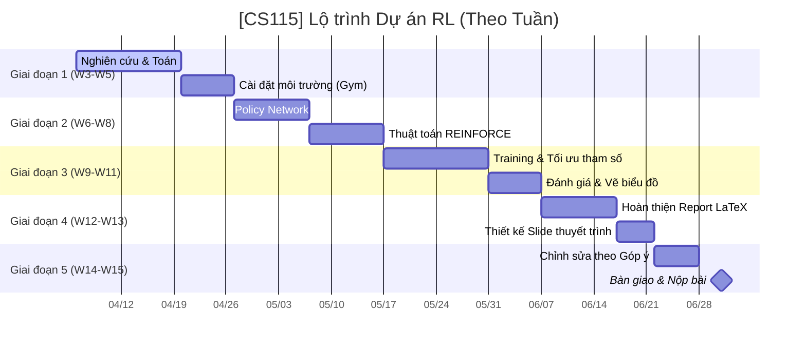

# [CS115] Policy Gradient for Reinforcement Learning (RL) - Nhóm 05

Dự án này khám phá các nền tảng toán học và việc triển khai thực tế của các phương pháp **Policy Gradient**, cụ thể là thuật toán **REINFORCE**, được áp dụng vào các bài toán điều khiển kinh điển từ thư viện `Gymnasium`.

---

## 👥 Thành viên Nhóm 05

| MSSV     | Họ Tên             | Vai Trò     | GitHub                                                             |
| :------- | :----------------- | :---------- | :----------------------------------------------------------------- |
| 25730067 | Đặng Chí Thanh     | Team Leader | [@uit-25730067-chithanh](https://github.com/uit-25730067-chithanh) |
| 25730061 | Hoàng Cao Sơn      | Math Lead   | [@uit-25730061-caoson](https://github.com/uit-25730061-caoson)     |
| 26210070 | Phạm Vũ Xuân Quỳnh | Thư ký      | [@xuanquynhphamvu](https://github.com/xuanquynhphamvu)             |
| 25730094 | Nguyễn Đức Ý       | Code Lead   | [@ducy11](https://github.com/ducy11)                               |

---

## 🗺️ Lộ trình Dự án (Roadmap)

---

## 🦴 Kiến trúc Cốt lõi: 4 Trụ cột

Để làm chủ thành công Policy Gradient, chúng tôi tập trung vào 4 trụ cột kỹ thuật sau:

### 1. Toán học

- **Hàm Mục tiêu ($J(\theta)$)**: Định nghĩa phần thưởng kỳ vọng tổng cộng.
- **Log-derivative Trick**: Biến đổi toán học để có thể tính được đạo hàm.
- **Gradient Ascent**: Cực đại hóa xác suất của các hành động mang lại giá trị phần thưởng cao.

### 2. Môi trường (Gymnasium)

- **Bài toán**: `CartPole-v1` (Giữ thăng bằng cây gậy).
- **Giao diện**: Vòng lặp tương tác (State $\to$ Action $\to$ Reward).

### 3. Policy Network (PyTorch)

- **Kiến trúc**: Mạng nơ-ron học sâu đơn giản (DNN).
- **Đầu vào**: Các trạng thái của môi trường.
- **Đầu ra**: Phân phối xác suất của các hành động.

### 4. Huấn luyện & Phân tích

- **Thu thập dữ liệu**: Lịch sử các bước theo từng Episode.
- **Lan truyền ngược (Backpropagation)**: Cập nhật trọng số mạng dựa trên phần thưởng.
- **Trực quan hóa**: Biểu đồ quá trình học và lịch sử huấn luyện.

---

## 📐 Cốt lõi Toán học: Định lý Policy Gradient

Mục tiêu chính là tối ưu hóa phần thưởng kỳ vọng $J(\theta)$ bằng cách điều chỉnh các tham số $\theta$ của một policy ngẫu nhiên $\pi_{\theta}(a|s)$.

### Công thức Chính

$$ \nabla*{\theta} J(\theta) = \mathbb{E}*{\pi*{\theta}} \left[ \sum*{t=0}^{T} \nabla*{\theta} \log \pi*{\theta}(a_t|s_t) \hat{A}\_t \right] $$

Trong đó:

- $\pi_{\theta}(a_t|s_t)$: Xác suất thực hiện hành động $a_t$ ở trạng thái $s_t$.
- $\hat{A}_t$: Ước lượng Advantage hoặc phần thưởng tích lũy (Return $G_t$).
- **Log-derivative Trick**: $\nabla_{\theta} \pi_{\theta}(a|s) = \pi_{\theta}(a|s) \nabla_{\theta} \log \pi_{\theta}(a|s)$.

---

## 🛠 Cấu trúc Dự án (WBS)

| Phân hệ      | Nội dung chi tiết                                  | Lead       | Member     |
| :----------- | :------------------------------------------------- | :--------- | :--------- |
| **Toán**     | Chứng minh định lý PG, Log-derivative trick, LaTeX | Hoàng Sơn  | Đức Ý      |
| **Kỹ thuật** | Gymnasium Env, PyTorch Policy Network, REINFORCE   | Đức Ý      | Xuân Quỳnh |
| **Review**   | Tinh chỉnh tham số, Analytics, Tổng hợp báo cáo    | Xuân Quỳnh | Hoàng Sơn  |

---

## 📂 Tổ chức Thư mục (Repository)

- `math/`: Mã nguồn LaTeX và các công thức toán học.
- `sources/`: Cài đặt chính của điệp viên RL (Agent) và kiến trúc mạng.
- `reports/`: Các bản cập nhật hàng tuần và phân tích thực nghiệm.
- `scripts/`: Chứa các đoạn mã hỗ trợ huấn luyện và vẽ biểu đồ.
- `data/`: Trọng số mô hình (checkpoints) và nhật ký huấn luyện.
- `docs/`: Tài liệu dự án và quản lý.

---

## 🚩 Các Giai đoạn chính (Milestones)

Dự án được chia thành 5 giai đoạn (Milestones) chính, bám sát lịch học kỳ:

1. **M1: Foundation (Tuần 3 - 5)**: Thiết lập nền tảng, hoàn thành chứng minh toán PG Theorem và cài đặt môi trường.
2. **M2: Core Algorithm (Tuần 6 - 8)**: Xây dựng mạng nơ-ron và hiện thực hóa thuật toán REINFORCE cơ bản.
3. **M3: Training & Analysis (Tuần 9 - 11)**: Huấn luyện mô hình, tối ưu hóa tham số và vẽ các biểu đồ phân tích.
4. **M4: Report & Slides (Tuần 12 - 13)**: Hoàn thiện báo cáo bản cứng và thiết kế slide thuyết trình.
5. **M5: Final Submission (Tuần 14 - 15)**: Chỉnh sửa theo góp ý của giảng viên và nộp bài chính thức.

---

## 📅 Kế hoạch Hành động: Tuần 03 (Khởi động)

- [x] Khởi tạo Repository & Cài đặt Git.
- [x] Lập kế hoạch dự án ban đầu & WBS.
- [ ] Nghiên cứu: Thuật toán "Reinforce" cho không gian hành động rời rạc.
- [ ] Cơ sở (Baseline): Cài đặt `CartPole-v1` bằng hành động ngẫu nhiên.

---

## 🤝 Bản cam kết Nhóm 05

- **Thời gian phản hồi**: 12-24 giờ.
- **Cam kết**: Tuyệt đối không copy-paste code nếu không thực sự hiểu.
- **Công cụ áp dụng**: GitHub Projects để theo dõi, Python cho xử lý chính, LaTeX để viết báo cáo.

---

## 📤 Quy định Nộp đồ án (Học kỳ)

### Đồ án cuối kì (Deadline: 30/06/2026)

- **Thời gian mở nộp:** Thứ Bảy, 30/05/2026 (12:00 AM)
- **Deadline:** Thứ Tư, 01/07/2026 (11:59 PM)
- **Yêu cầu nộp bài:**
  - Các nhóm cần chỉnh sửa slides và demo theo góp ý của giảng viên trong buổi báo cáo.
  - **Thành phần bài nộp:**
    1. Slides trình bày.
    2. Demo/kết quả thực nghiệm (figures, tables, plots).
    3. Source code & data để tái lập kết quả.
    4. Report (Optional - Khuyến khích).
    5. Clip thuyết trình (dành cho nhóm chưa báo cáo trực tiếp).
  - **Format:** Nén vào 1 file `.zip` với tên: `ID_group.zip`.
  - **Lưu ý:** Chỉ một SV đại diện nộp. Nếu file quá lớn (>100MB), nộp file `.txt` chứa link Google Drive (chế độ Public).

---

© 2026 CS115 - Trường Đại học Công nghệ Thông tin (UIT)
