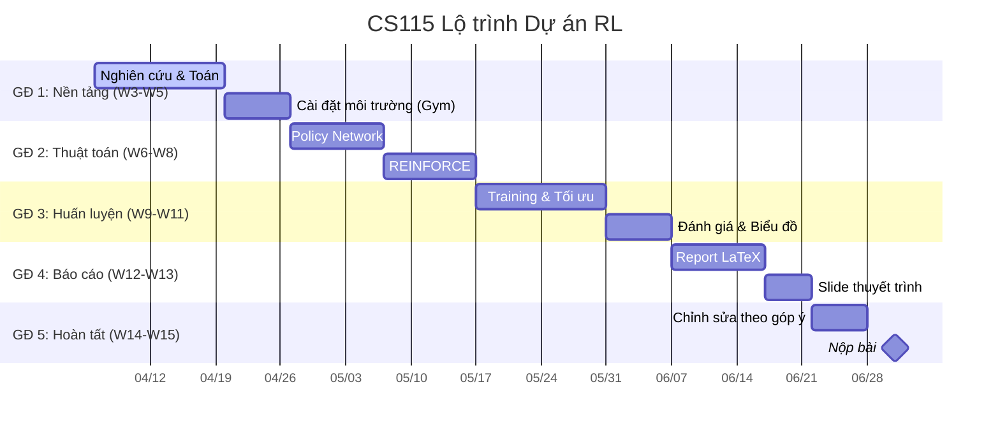

# [CS115] Policy Gradient for Reinforcement Learning (RL) - Nhóm 05

[](https://github.com/users/uit-25730067-chithanh/projects/1)


Khám phá nền tảng toán học và triển khai thực tế **Policy Gradient** (thuật toán REINFORCE) trên các bài toán điều khiển kinh điển từ `Gymnasium`.

> Môn: _CS115 - Toán cho Khoa học máy tính_ | Trường ĐH Công nghệ Thông tin (UIT)

---

## 👥 Nhóm 05

| MSSV     | Họ Tên             | Vai Trò     | Hỗ Trợ | GitHub                                                             |
| :------- | :----------------- | :---------- | :----- | :----------------------------------------------------------------- |
| 25730067 | Đặng Chí Thanh     | Team Leader | All    | [@uit-25730067-chithanh](https://github.com/uit-25730067-chithanh) |
| 25730061 | Hoàng Cao Sơn      | Math Lead   | Report | [@uit-25730061-caoson](https://github.com/uit-25730061-caoson)     |
| 25730094 | Nguyễn Đức Ý       | Code Lead   | Math   | [@ducy11](https://github.com/ducy11)                               |
| 26210070 | Phạm Vũ Xuân Quỳnh | Report Lead | Code   | [@xuanquynhphamvu](https://github.com/xuanquynhphamvu)             |

---

## 🗺️ Lộ trình (Roadmap)



---

## 🦴 4 Trụ cột Kỹ thuật

### 1. Toán học

- **Hàm mục tiêu** $J(\theta)$: Phần thưởng kỳ vọng.
- **Log-derivative Trick**: Biến đổi để tính được đạo hàm.
- **Gradient Ascent**: Cực đại hóa xác suất hành động có phần thưởng cao.

### 2. Môi trường (Gymnasium)

- **Bài toán**: `CartPole-v1` (giữ thăng bằng gậy).
- **Vòng lặp**: State → Action → Reward.

### 3. Policy Network (PyTorch)

- **Kiến trúc**: DNN đơn giản.
- **Đầu vào**: Trạng thái → **Đầu ra**: Phân phối xác suất hành động.

### 4. Huấn luyện & Phân tích

- Thu thập trajectory theo episode.
- Lan truyền ngược với loss có trọng số phần thưởng.
- Trực quan hóa đường cong học tập.

---

## 📐 Định lý Policy Gradient

Tối ưu phần thưởng kỳ vọng $J(\theta)$ bằng cách điều chỉnh $\theta$ của policy $\pi_{\theta}(a|s)$.

$$ \nabla*{\theta} J(\theta) = \mathbb{E}*{\pi*{\theta}} \left[ \sum*{t=0}^{T} \nabla*{\theta} \log \pi*{\theta}(a_t|s_t) \hat{A}\_t \right] $$

- $\pi_{\theta}(a_t|s_t)$: Xác suất hành động $a_t$ ở trạng thái $s_t$.
- $\hat{A}_t$: Ước lượng Advantage hoặc Return $G_t$.
- **Log-derivative Trick**: $\nabla_{\theta} \pi_{\theta}(a|s) = \pi_{\theta}(a|s) \nabla_{\theta} \log \pi_{\theta}(a|s)$.

---

## 🛠 Phân chia Công việc (WBS)

| Phân hệ    | Nội dung                                     | Lead       | Hỗ trợ     |
| :--------- | :------------------------------------------- | :--------- | :--------- |
| **Toán**   | Chứng minh PG, Log-derivative trick, LaTeX   | Hoàng Sơn  | Đức Ý      |
| **Code**   | Gymnasium env, PyTorch policy net, REINFORCE | Đức Ý      | Xuân Quỳnh |
| **Report** | Tối ưu tham số, analytics, viết báo cáo      | Xuân Quỳnh | Hoàng Sơn  |

---

## 📂 Cấu trúc Thư mục

```
├── math/       # LaTeX & công thức toán
├── sources/    # Code RL agent & mạng nơ-ron
├── reports/    # Cập nhật hàng tuần & phân tích
├── scripts/    # Script huấn luyện & vẽ biểu đồ
├── data/       # Checkpoints & training logs
├── docs/       # Tài liệu dự án & biên bản họp
└── notes/      # Ghi chú cá nhân
```

---

## 🚩 Các cột mốc (Milestones)

1. **M1: Nền tảng (W3-W5)** — Chứng minh PG theorem + setup môi trường.
2. **M2: Thuật toán (W6-W8)** — Mạng nơ-ron + implement REINFORCE.
3. **M3: Huấn luyện (W9-W11)** — Train, tối ưu tham số, vẽ biểu đồ.
4. **M4: Báo cáo (W12-W13)** — Hoàn thiện report + slide thuyết trình.
5. **M5: Nộp bài (W14-W15)** — Chỉnh theo góp ý GV + nộp chính thức.

---

## 📅 Tiến độ

### Tuần 03 (Khởi động) — 6/4/2026

- [x] Khởi tạo repo & Git setup.
- [x] Lập kế hoạch & WBS.
- [x] Hoàn tất Team Charter v3.0.
- [x] Tạo GitHub Project board.
- [ ] Nghiên cứu: REINFORCE cho không gian hành động rời rạc.
- [ ] Baseline: `CartPole-v1` với hành động ngẫu nhiên.

### Tuần 04 (Mở rộng nền tảng) — 13/4/2026

- [ ] Bản nháp chứng minh PG theorem (LaTeX, `math/`).
- [ ] Giải thích Log-derivative trick.
- [ ] Skeleton Policy Network (PyTorch).
- [ ] Experience buffer cho trajectory (S, A, R).
- [ ] Report: phần Introduction & Math Foundations.
- [ ] Thống nhất quy trình: branch → PR → merge main.

---

## 🤝 Cam kết Nhóm (Charter v3.0)

- **Kênh liên lạc**: MS Teams (chính) | Zalo (khẩn cấp).
- **SLA**: 12-24h phản hồi. Quiet hours: 23h-07h & 18h30-21h.
- **Deadline Sprint**: 23:00 Chủ nhật hàng tuần.
- **AI**: Chỉ tham khảo, không copy-paste. Viết lại theo ý hiểu.
- **Chất lượng**: Cơ chế "Giải trình Logic" — owner phải giải thích cho reviewer.
- **Xung đột**: Nói thẳng → họp 15 phút → Leader quyết.
- **Mục tiêu**: A+ (9.0-10.0). Học thật, không đi tắt.

---

## 📤 Quy định Nộp bài

### Đồ án cuối kì (Deadline: 1/7/2026)

- **Mở nộp**: T7, 30/05/2026 (00:00)
- **Hết hạn**: T4, 01/07/2026 (23:59)
- **Thành phần**: Slides, demo/kết quả, source code & data, report (tùy chọn), video (nếu chưa báo cáo trực tiếp).
- **Format**: 1 file `.zip` → `ID_group.zip`. Nếu >100MB, nộp `.txt` chứa link GDrive (public).

---

© 2026 CS115 - Trường Đại học Công nghệ Thông tin (UIT)
