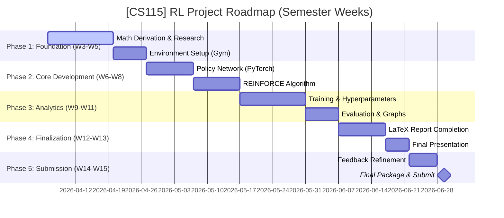

# [CS115] Policy Gradient for Reinforcement Learning (RL) - Team 05

This project explores the mathematical foundations and practical implementation of **Policy Gradient** methods, specifically the **REINFORCE** algorithm, applied to classic control problems from the `Gymnasium` library.

---

## 👥 Team 05 Members

| MSSV         | Full Name          | Role               |
| :----------- | :----------------- | :----------------- |
| **25730067** | **Đặng Chí Thanh** | **Team Leader**    |
| 25730061     | Hoàng Cao Sơn      | Math Lead          |
| 26210070     | Phạm Vũ Xuân Quỳnh | Secretary (Thư ký) |
| 25730094     | Nguyễn Đức Ý       | Code Lead          |

---

## 🗺️ Project Roadmap

---

## 🦴 The Skeleton: 4 Core Pillars

To successfully master Policy Gradient, we focus on these four technical pillars:

### 1. The Math Core

- **Objective Function ($J(\theta)$)**: Defining the expected total reward.
- **Log-derivative Trick**: Mathematical transformation to make gradients computable.
- **Gradient Ascent**: Maximizing the probability of high-reward actions.

### 2. The Environment (Gymnasium)

- **Problem**: `CartPole-v1` (Balancing the pole).
- **Interface**: Interaction loop (State $\to$ Action $\to$ Reward).

### 3. The Policy Network (PyTorch)

- **Architecture**: Simple Deep Neural Network (DNN).
- **Input**: Environmental states.
- **Output**: Action probability distribution.

### 4. Training & Analytics

- **Data Collection**: Episode-based trajectories.
- **Backpropagation**: Updating network weights based on rewards.
- **Visualization**: Learning curves and training history.

---

## 📐 Mathematical Core: The Policy Gradient Theorem

Our main objective is to optimize the expected reward $J(\theta)$ by adjusting the parameters $\theta$ of a stochastic policy $\pi_{\theta}(a|s)$.

### Key Formula

$$ \nabla*{\theta} J(\theta) = \mathbb{E}*{\pi*{\theta}} \left[ \sum*{t=0}^{T} \nabla*{\theta} \log \pi*{\theta}(a_t|s_t) \hat{A}\_t \right] $$

Where:

- $\pi_{\theta}(a_t|s_t)$: Probability of taking action $a_t$ in state $s_t$.
- $\hat{A}_t$: Advantage estimate or cumulative reward (Return $G_t$).
- **Log-derivative Trick**: $\nabla_{\theta} \pi_{\theta}(a|s) = \pi_{\theta}(a|s) \nabla_{\theta} \log \pi_{\theta}(a|s)$.

---

## 🛠 Project Structure (WBS)

| Module     | Focus                                                 | Lead  | Member |
| :--------- | :---------------------------------------------------- | :---- | :----- |
| **Math**   | Proof of PG theorem, Log-derivative trick, LaTeX docs | Sơn   | Ý      |
| **Code**   | Gymnasium Env, PyTorch Policy Network, REINFORCE      | Ý     | Quỳnh  |
| **Review** | Hyperparameter tuning, Analytics, Report synthesis    | Quỳnh | Sơn    |

---

## 📂 Repository Organization

- `math/`: LaTeX sources and mathematical derivations.
- `sources/`: Core implementation of RL agent and network architectures.
- `reports/`: Weekly updates and experimental analysis.
- `scripts/`: Helper scripts for training and visualization.
- `data/`: Model checkpoints and training logs.
- `docs/`: Project documentation and management.

---

## 🚩 Các Giai đoạn chính (Milestones)

Dự án được chia thành 5 giai đoạn (Milestones) chính, bám sát lịch học kỳ:

1. **M1: Foundation (Tuần 3 - 5)**: Thiết lập nền tảng, hoàn thành chứng minh toán PG Theorem và cài đặt môi trường.
2. **M2: Core Algorithm (Tuần 6 - 8)**: Xây dựng mạng nơ-ron và hiện thực hóa thuật toán REINFORCE cơ bản.
3. **M3: Training & Analysis (Tuần 9 - 11)**: Huấn luyện mô hình, tối ưu hóa tham số và vẽ các biểu đồ phân tích.
4. **M4: Report & Slides (Tuần 12 - 13)**: Hoàn thiện báo cáo bản cứng và thiết kế slide thuyết trình.
5. **M5: Final Submission (Tuần 14 - 15)**: Chỉnh sửa theo góp ý của giảng viên và nộp bài chính thức.

---

## 📅 Action Plan: Week 3 (Kick-off)

- [x] Repository initialization & Git setup.
- [x] Initial project planning & WBS.
- [ ] Research: "Reinforce Algorithm" for discrete action spaces.
- [ ] Baseline: Implementation of `CartPole-v1` with random actions.

---

## 🤝 Team 05 - Charter

- **Response Time**: 12-24 hours.
- **Commitment**: No copy-pasting code without understanding.
- **Tooling**: GitHub Projects for tracking, Python for core logic, LaTeX for reporting.

---

## 📤 Quy định Nộp đồ án (Học kỳ)

### Đồ án cuối kì (Deadline: 30/06/2026)

- **Thời gian mở nộp:** Thứ Bảy, 30/05/2026 (12:00 AM)
- **Deadline:** Thứ Tư, 01/07/2026 (11:59 PM)
- **Yêu cầu nộp bài:**
  - Các nhóm cần chỉnh sửa slides và demo theo góp ý của giảng viên trong buổi báo cáo.
  - **Thành phần bài nộp:**
    1. Slides trình bày.
    2. Demo/kết quả thực nghiệm (figures, tables, plots).
    3. Source code & data để tái lập kết quả.
    4. Report (Optional - Khuyến khích).
    5. Clip thuyết trình (dành cho nhóm chưa báo cáo trực tiếp).
  - **Format:** Nén vào 1 file `.zip` với tên: `ID_group.zip`.
  - **Lưu ý:** Chỉ một SV đại diện nộp. Nếu file quá lớn (>100MB), nộp file `.txt` chứa link Google Drive (chế độ Public).

---

© 2026 CS115 - University of Information Technology (UIT)
