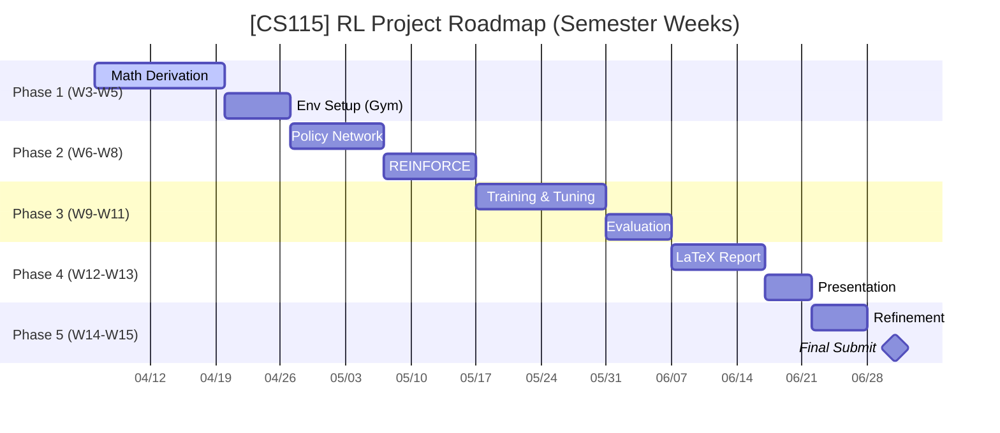

# [CS115] Policy Gradient for Reinforcement Learning (RL) - Team 05

This project explores the mathematical foundations and practical implementation of **Policy Gradient** methods, specifically the **REINFORCE** algorithm, applied to classic control problems from the `Gymnasium` library.

---

## 👥 Team 05 Members

| MSSV     | Full Name          | Role        | GitHub                                                             |
| :------- | :----------------- | :---------- | :----------------------------------------------------------------- |
| 25730067 | Đặng Chí Thanh     | Team Leader | [@uit-25730067-chithanh](https://github.com/uit-25730067-chithanh) |
| 25730061 | Hoàng Cao Sơn      | Math Lead   | [@uit-25730061-caoson](https://github.com/uit-25730061-caoson)     |
| 26210070 | Phạm Vũ Xuân Quỳnh | Secretary   | [@xuanquynhphamvu](https://github.com/xuanquynhphamvu)             |
| 25730094 | Nguyễn Đức Ý       | Code Lead   | [@ducy11](https://github.com/ducy11)                               |

---

## 🗺️ Project Roadmap

---

## 🦴 The Skeleton: 4 Core Pillars

To successfully master Policy Gradient, we focus on these four technical pillars:

### 1. The Math Core

- **Objective Function ($J(\theta)$)**: Defining the expected total reward.
- **Log-derivative Trick**: Mathematical transformation to make gradients computable.
- **Gradient Ascent**: Maximizing the probability of high-reward actions.

### 2. The Environment (Gymnasium)

- **Problem**: `CartPole-v1` (Balancing the pole).
- **Interface**: Interaction loop (State $\to$ Action $\to$ Reward).

### 3. The Policy Network (PyTorch)

- **Architecture**: Simple Deep Neural Network (DNN).
- **Input**: Environmental states.
- **Output**: Action probability distribution.

### 4. Training & Analytics

- **Data Collection**: Episode-based trajectories.
- **Backpropagation**: Updating network weights based on rewards.
- **Visualization**: Learning curves and training history.

---

## 📐 Mathematical Core: The Policy Gradient Theorem

Our main objective is to optimize the expected reward $J(\theta)$ by adjusting the parameters $\theta$ of a stochastic policy $\pi_{\theta}(a|s)$.

### Key Formula

$$ \nabla*{\theta} J(\theta) = \mathbb{E}*{\pi*{\theta}} \left[ \sum*{t=0}^{T} \nabla*{\theta} \log \pi*{\theta}(a_t|s_t) \hat{A}\_t \right] $$

Where:

- $\pi_{\theta}(a_t|s_t)$: Probability of taking action $a_t$ in state $s_t$.
- $\hat{A}_t$: Advantage estimate or cumulative reward (Return $G_t$).
- **Log-derivative Trick**: $\nabla_{\theta} \pi_{\theta}(a|s) = \pi_{\theta}(a|s) \nabla_{\theta} \log \pi_{\theta}(a|s)$.

---

## 🛠 Project Structure (WBS)

| Module     | Focus                                                 | Lead       | Member     |
| :--------- | :---------------------------------------------------- | :--------- | :--------- |
| **Math**   | Proof of PG theorem, Log-derivative trick, LaTeX docs | Hoàng Sơn  | Đức Ý      |
| **Code**   | Gymnasium Env, PyTorch Policy Network, REINFORCE      | Đức Ý      | Xuân Quỳnh |
| **Review** | Hyperparameter tuning, Analytics, Report synthesis    | Xuân Quỳnh | Hoàng Sơn  |

---

## 📂 Repository Organization

- `math/`: LaTeX sources and mathematical derivations.
- `sources/`: Core implementation of RL agent and network architectures.
- `reports/`: Weekly updates and experimental analysis.
- `scripts/`: Helper scripts for training and visualization.
- `data/`: Model checkpoints and training logs.
- `docs/`: Project documentation and management.

---

## 🚩 Key Milestones

The project is divided into 5 main milestones, aligned with the semester schedule:

1. **M1: Foundation (Weeks 3 - 5)**: Establish the foundation, complete the mathematical proof of the PG Theorem, and set up the environment.
2. **M2: Core Algorithm (Weeks 6 - 8)**: Build the neural network architecture and implement the foundational REINFORCE algorithm.
3. **M3: Training & Analysis (Weeks 9 - 11)**: Train the model, tune hyperparameters, and plot analytical graphs.
4. **M4: Report & Slides (Weeks 12 - 13)**: Finalize the hardcopy report and design the presentation slides.
5. **M5: Final Submission (Weeks 14 - 15)**: Revise based on the instructor's feedback and officially submit the package.

---

## 📅 Action Plan: Week 03 (Kick-off)

- [x] Repository initialization & Git setup.
- [x] Initial project planning & WBS.
- [ ] Research: "Reinforce Algorithm" for discrete action spaces.
- [ ] Baseline: Implementation of `CartPole-v1` with random actions.

---

## 🤝 Team 05 - Charter

- **Response Time**: 12-24 hours.
- **Commitment**: No copy-pasting code without understanding.
- **Tooling**: GitHub Projects for tracking, Python for core logic, LaTeX for reporting.

---

## 📤 Submission Guidelines (Semester)

### Final Project (Deadline: June 30, 2026)

- **Submission Opens:** Saturday, May 30, 2026 (12:00 AM)
- **Deadline:** Wednesday, July 01, 2026 (11:59 PM)
- **Submission Requirements:**
  - Teams must revise their slides and demo based on the instructor's feedback during the presentation.
  - **Submission Components:**
    1. Presentation slides.
    2. Demo/experimental results (figures, tables, plots).
    3. Source code & data to reproduce results.
    4. Report (Optional - Recommended).
    5. Presentation video (for teams that haven't presented locally).
  - **Format:** Compress into a single `.zip` file named: `ID_group.zip`.
  - **Note:** Only one representative student should submit. If the file is too large (>100MB), submit a `.txt` file containing a Google Drive link (Public mode).

---

© 2026 CS115 - University of Information Technology (UIT)
