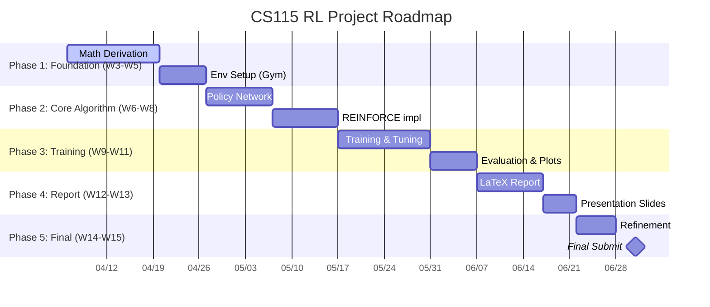

# [CS115] Policy Gradient for Reinforcement Learning (RL) - Team 05

[](https://github.com/users/uit-25730067-chithanh/projects/1)


Explore math foundations & practical implementation of **Policy Gradient** (REINFORCE algorithm) on classic control problems using `Gymnasium`.

> Course: _CS115 - Math for Computer Science_ | University of Information Technology (UIT)

---

## 👥 Team 05

| ID       | Name               | Role        | Support | GitHub                                                             |
| :------- | :----------------- | :---------- | :------ | :----------------------------------------------------------------- |
| 25730067 | Đặng Chí Thanh     | Team Leader | All     | [@uit-25730067-chithanh](https://github.com/uit-25730067-chithanh) |
| 25730061 | Hoàng Cao Sơn      | Math Lead   | Report  | [@uit-25730061-caoson](https://github.com/uit-25730061-caoson)     |
| 25730094 | Nguyễn Đức Ý       | Code Lead   | Math    | [@ducy11](https://github.com/ducy11)                               |
| 26210070 | Phạm Vũ Xuân Quỳnh | Report Lead | Code    | [@xuanquynhphamvu](https://github.com/xuanquynhphamvu)             |

---

## 🗺️ Roadmap



---

## 🦴 4 Core Pillars

### 1. Math Core

- **Objective Function** $J(\theta)$: Expected total reward.
- **Log-derivative Trick**: Transform gradient to computable form.
- **Gradient Ascent**: Maximize probability of high-reward actions.

### 2. Environment (Gymnasium)

- **Problem**: `CartPole-v1` (balance the pole).
- **Loop**: State → Action → Reward.

### 3. Policy Network (PyTorch)

- **Arch**: Simple DNN.
- **Input**: Environment states → **Output**: Action probability distribution.

### 4. Training & Analytics

- Episode-based trajectory collection.
- Backprop with reward-weighted loss.
- Learning curve visualization.

---

## 📐 Policy Gradient Theorem

Optimize expected reward $J(\theta)$ by adjusting parameters $\theta$ of stochastic policy $\pi_{\theta}(a|s)$.

$$ \nabla*{\theta} J(\theta) = \mathbb{E}*{\pi*{\theta}} \left[ \sum*{t=0}^{T} \nabla*{\theta} \log \pi*{\theta}(a_t|s_t) \hat{A}\_t \right] $$

- $\pi_{\theta}(a_t|s_t)$: Prob of action $a_t$ in state $s_t$.
- $\hat{A}_t$: Advantage estimate or cumulative return $G_t$.
- **Log-derivative Trick**: $\nabla_{\theta} \pi_{\theta}(a|s) = \pi_{\theta}(a|s) \nabla_{\theta} \log \pi_{\theta}(a|s)$.

---

## 🛠 WBS (Work Breakdown)

| Module     | Focus                                          | Lead       | Support    |
| :--------- | :--------------------------------------------- | :--------- | :--------- |
| **Math**   | PG theorem proof, Log-derivative trick, LaTeX  | Hoàng Sơn  | Đức Ý      |
| **Code**   | Gymnasium env, PyTorch policy net, REINFORCE   | Đức Ý      | Xuân Quỳnh |
| **Report** | Hyperparameter tuning, analytics, report write | Xuân Quỳnh | Hoàng Sơn  |

---

## 📂 Repo Structure

```
├── math/       # LaTeX sources & math derivations
├── sources/    # RL agent & network implementation
├── reports/    # Weekly updates & experiment analysis
├── scripts/    # Training & visualization helpers
├── data/       # Model checkpoints & training logs
├── docs/       # Project docs & meeting records
└── notes/      # Personal study notes
```

---

## 🚩 Milestones

1. **M1: Foundation (W3-W5)** — Math proof of PG theorem + env setup.
2. **M2: Core Algorithm (W6-W8)** — Neural network + REINFORCE impl.
3. **M3: Training (W9-W11)** — Train, tune hyperparams, plot analytics.
4. **M4: Report & Slides (W12-W13)** — Finalize hardcopy report + slides.
5. **M5: Final Submit (W14-W15)** — Revise per instructor feedback + submit.

---

## 📅 Progress Tracker

### Week 03 (Kick-off) — Apr 6, 2026

- [x] Repo init & Git setup.
- [x] Project planning & WBS.
- [x] Team Charter v3.0 finalized.
- [x] GitHub Project board created.
- [ ] Research: REINFORCE for discrete action spaces.
- [ ] Baseline: `CartPole-v1` with random actions.

### Week 04 (Foundation Expansion) — Apr 13, 2026

- [ ] Draft PG theorem proof (LaTeX, `math/`).
- [ ] Log-derivative trick explanation.
- [ ] Policy network skeleton (PyTorch).
- [ ] Experience buffer for trajectory (S, A, R).
- [ ] Report: Introduction & Math Foundations section.
- [ ] Unified workflow: branch → PR → merge to main.

---

## 🤝 Team Charter (v3.0 Summary)

- **Comms**: MS Teams (primary) | Zalo (urgent only).
- **SLA**: 12-24h response. Quiet hours: 23h-07h & 18h30-21h.
- **Sprint deadline**: 23:00 Sun weekly.
- **AI policy**: Reference only, no copy-paste. Rephrase in own words.
- **Quality**: "Logic Explanation" — owner must explain logic to reviewer.
- **Conflict**: Direct dialogue → 15min meeting → Leader decides.
- **Goal**: A+ (9.0-10.0). Learn for real, no shortcuts.

---

## 📤 Submission (Semester)

### Final Project (Deadline: Jul 1, 2026)

- **Opens:** Sat, May 30, 2026 (12:00 AM)
- **Due:** Wed, Jul 01, 2026 (11:59 PM)
- **Components:** Slides, demo/results, source code & data, report (optional), video (if no live presentation).
- **Format:** Single `.zip` → `ID_group.zip`. If >100MB, submit `.txt` with public Google Drive link.

---

© 2026 CS115 - University of Information Technology (UIT)
