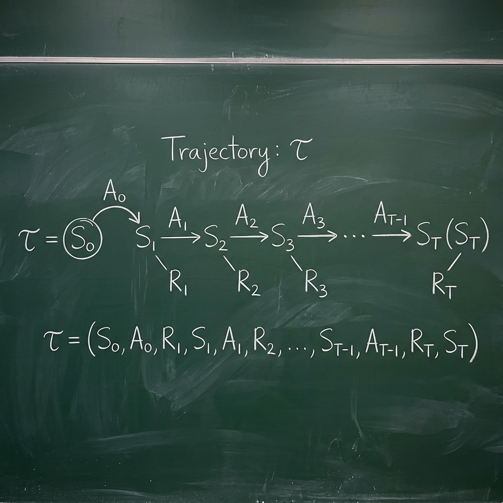
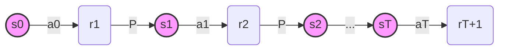

# Xác suất và Khái niệm Trajectory (Quỹ đạo)

Để hiểu được thuật toán REINFORCE, chúng ta phải chuyển từ cách tư duy "từng bước một" sang tư duy trên "toàn bộ quá trình". Trong RL, quá trình này được gọi là một **Trajectory**.

## 1. Định nghĩa Trajectory ($\tau$)

 Một trajectory $\tau$ là một chuỗi các trạng thái và hành động từ lúc bắt đầu cho đến khi kết thúc một episode (tập phim):

$$\tau = (s_0, a_0, r_1, s_1, a_1, r_2, \dots, s_T, a_T, r_{T+1})$$

### Hình minh họa Quỹ đạo (Trajectory Flow)

*Trong đó:*
- Các nút tròn màu hồng đại diện cho **Trạng thái (State)**.
- Các mũi tên đại diện cho **Hành động (Action)** được chọn bởi Agent.
- Các nút hình chữ nhật đại diện cho **Phần thưởng (Reward)** trả về từ môi trường.
- **P** là xác suất chuyển trạng thái ngẫu nhiên của môi trường.

## 2. Xác suất của một Trajectory $P(\tau | \theta)$

Dưới một chính sách $\pi_{\theta}$, xác suất để một trajectory cụ thể $\tau$ xảy ra phụ thuộc vào cả chính sách của Agent và xác suất chuyển trạng thái của môi trường:

$$
P(\tau | \theta) = \mu(s_0) \prod_{t=0}^{T} \pi_{\theta}(a_t | s_t) P(s_{t+1} | s_t, a_t)
$$

Trong đó:
*   $\mu(s_0)$: Xác suất trạng thái khởi đầu.
*   $\pi_{\theta}(a_t | s_t)$: Chính sách của chúng ta (phụ thuộc vào $\theta$).
*   $P(s_{t+1} | s_t, a_t)$: Dynamics của môi trường (không phụ thuộc vào $\theta$).

**Điểm mấu chốt:** Khi chúng ta lấy đạo hàm theo $\theta$, các thành phần không phụ thuộc vào $\theta$ (như $P(s_{t+1} | s_t, a_t)$) sẽ biến mất. Đây là lý do tại sao chúng ta có thể tối ưu hóa chính sách mà không cần biết mô hình vật lý của môi trường.

## 3. Tổng phần thưởng của Trajectory $R(\tau)$

Mục tiêu là tối đa hóa tổng phần thưởng trên quỹ đạo đó:

$$
R(\tau) = \sum_{t=0}^{T} \gamma^t r_{t+1}
$$

Lưu ý: $R(\tau)$ là một giá trị cố định cho một quỹ đạo đã thực hiện xong. Tuy nhiên, vì $\tau$ là một biến ngẫu nhiên (do chính sách ngẫu nhiên), nên $R(\tau)$ cũng là một biến ngẫu nhiên.

## 4. Hàm mục tiêu dưới dạng Kỳ vọng (Expectation)

Bây giờ, chúng ta có thể viết lại hàm mục tiêu $J(\theta)$ một cách gọn gàng nhất:

$$
J(\theta) = \mathbb{E}_{\tau \sim \pi_{\theta}} [R(\tau)] = \int P(\tau | \theta) R(\tau) d\tau
$$

Công thức này nói rằng: Chúng ta muốn giá trị trung bình của tổng phần thưởng trên tất cả các quỹ đạo có thể xảy ra là lớn nhất. Thuật toán REINFORCE sẽ tìm cách tăng xác suất $P(\tau | \theta)$ của những quỹ đạo có $R(\tau)$ cao và giảm xác suất của những quỹ đạo có $R(\tau)$ thấp.

---

## Nguồn tham khảo

- **Sutton & Barto (2018).** *Reinforcement Learning: An Introduction*, 2nd Ed. — §3.3 Returns (p.55), §13.2 Trajectory probability (p.326). [Online](http://incompleteideas.net/book/the-book-2nd.html)
- **OpenAI Spinning Up.** Part 3: Intro to Policy Optimization — "Deriving the Simplest Policy Gradient" section. [Link](https://spinningup.openai.com/en/latest/spinningup/rl_intro3.html)
