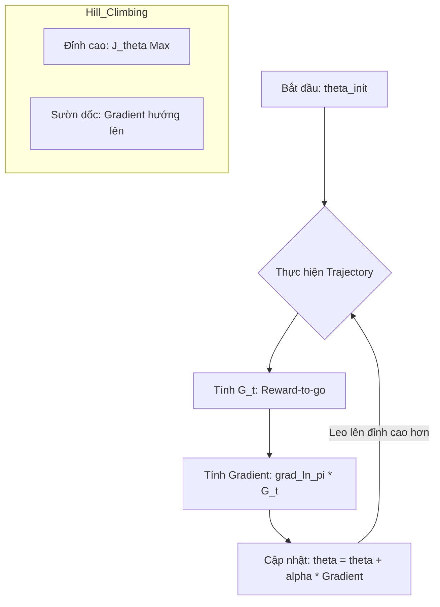

# Log-derivative Trick: Chìa khóa đạo hàm kỳ vọng

Log-derivative trick (còn gọi là Likelihood Ratio trick) là một đồng nhất thức toán học cực kỳ đơn giản nhưng lại đóng vai trò quyết định trong việc thực thi các thuật toán Policy Gradient. Nó cho phép chúng ta ước lượng đạo hàm của một kỳ vọng bằng phương pháp lấy mẫu Monte Carlo.

## 1. Đồng nhất thức cơ bản

Xét một hàm số $f(x)$ dương và có đạo hàm. Theo quy tắc đạo hàm của hàm hợp (chain rule) đối với hàm logarit:

$$\frac{d}{dx} \ln(f(x)) = \frac{f'(x)}{f(x)}$$

Từ đó, ta có thể suy ra biểu thức cho đạo hàm của $f(x)$:

$$f'(x) = f(x) \frac{d}{dx} \ln(f(x))$$

Trong ngữ cảnh vector tham số $\theta$, đồng nhất thức này trở thành:

$$\nabla_\theta \pi_\theta(a|s) = \pi_\theta(a|s) \nabla_\theta \ln \pi_\theta(a|s)$$

## 2. Tại sao lại cần dùng Log-derivative trick?

Như đã phân tích ở phần Foundations, đạo hàm của hàm mục tiêu $J(\theta)$ có dạng:

$$\nabla_\theta J(\theta) = \int \nabla_\theta P(\tau | \theta) R(\tau) d\tau$$

Biểu thức này gặp khó khăn vì $\nabla_\theta P(\tau | \theta)$ không phải là một hàm mật độ xác suất. Bằng cách áp dụng Trick:

$$\nabla_\theta J(\theta) = \int P(\tau | \theta) \nabla_\theta \ln P(\tau | \theta) R(\tau) d\tau$$

Bây giờ, biểu thức đã trở lại dạng:

$$\nabla_\theta J(\theta) = \mathbb{E}_{\tau \sim \pi_\theta} [\nabla_\theta \ln P(\tau | \theta) R(\tau)]$$

## 3. Phân tách $\nabla_\theta \ln P(\tau | \theta)$

Đây là phần thú vị nhất. Nhớ lại định nghĩa của $P(\tau | \theta)$:

$$P(\tau | \theta) = \mu(s_0) \prod_{t=0}^{T} \pi_\theta(a_t | s_t) P(s_{t+1} | s_t, a_t)$$

Lấy logarit tự nhiên của cả hai vế:

$$\ln P(\tau | \theta) = \ln \mu(s_0) + \sum_{t=0}^{T} \ln \pi_\theta(a_t | s_t) + \sum_{t=0}^{T} \ln P(s_{t+1} | s_t, a_t)$$

Bây giờ, ta lấy đạo hàm theo $\theta$:

- $\nabla_\theta \ln \mu(s_0) = 0$ (vì trạng thái đầu không phụ thuộc vào tham số mạng).
- $\nabla_\theta \sum \ln P(s_{t+1} | s_t, a_t) = 0$ (vì dynamics của môi trường không phụ thuộc vào $\theta$).

Kết quả cuối cùng:

$$\nabla_\theta \ln P(\tau | \theta) = \sum_{t=0}^{T} \nabla_\theta \ln \pi_\theta(a_t | s_t)$$

## 4. Trực giác Toán học và Tối ưu hóa $J(\theta)$

Thay vì dùng "núm vặn", hãy nhìn nhận dưới lăng kính **Gradient Ascent** (Leo dốc).

### 4.1. Cơ chế "Đẩy" Xác suất

Thuật toán REINFORCE không cố gắng tìm "nhãn đúng" như Supervised Learning. Thay vào đó, nó thực hiện cơ chế sau:

1.  **Lấy mẫu (Explore):** Agent thực hiện một hành động $a$ ngẫu nhiên theo phân phối $\pi_\theta$.
2.  **Đánh giá (Evaluate):** Môi trường trả về phần thưởng $R(\tau)$.
3.  **Điều chỉnh (Adjust):**
    - Nếu $R(\tau) > 0$: Gradient $\nabla_\theta \ln \pi_\theta$ sẽ kéo tham số $\theta$ về hướng làm **tăng** xác suất $\pi_\theta(a|s)$.
    - Nếu $R(\tau) < 0$: Gradient sẽ đẩy tham số $\theta$ theo hướng làm **giảm** xác suất của hành động đó.

### 4.2. Hình ảnh hóa Gradient Ascent trên bề mặt $J(\theta)$

_Ghi chú:_ Việc sử dụng $\ln$ (Logarithm) có tác dụng quan trọng: Nó chuẩn hóa tốc độ thay đổi. Thay vì tăng xác suất một cách tuyến tính, đạo hàm của logarit tương ứng với **tốc độ thay đổi tương đối** ($\frac{\nabla \pi}{\pi}$), giúp việc cập nhật ổn định hơn khi xác suất đã tiến gần về 0 hoặc 1.

## 5. Kết luận

Log-derivative trick giúp chúng ta giải quyết được hai vấn đề cực lớn:

1.  **Model-free:** Chúng ta không cần biết hàm xác suất chuyển trạng thái $P(s'|s, a)$ của môi trường để tính đạo hàm.
2.  **Tính toán được:** Chúng ta có thể dùng các giá trị $\ln \pi_\theta$ thu được từ mạng neural và nhân với phần thưởng thực tế thu được từ môi trường để cập nhật tham số.

Trong code PyTorch, điều này tương ứng với việc tính `log_prob` của hành động đã thực hiện và sử dụng nó trong hàm Loss.
