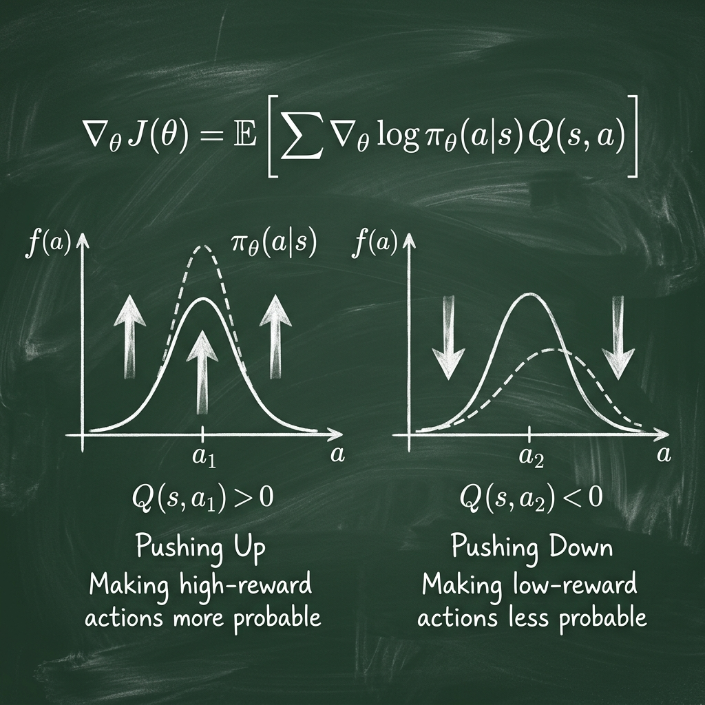

# Chứng minh Định lý Policy Gradient (toàn văn)

Định lý Policy Gradient (PG Theorem) là nền tảng cho mọi thuật toán RL dựa trên tối ưu hóa tham số chính sách (như REINFORCE, PPO, TRPO). Tài liệu này thực hiện chứng minh chi tiết định lý này cho trường hợp không gian hành động rời rạc.

## 1. Phát biểu Định lý

Cho một hàm mục tiêu $J(\theta) = \mathbb{E}_{\pi_\theta} [R(\tau)]$, đạo hàm của nó theo $\theta$ được tính bởi:

$$\nabla_\theta J(\theta) = \mathbb{E}_{\pi_\theta} \left[ \sum_{t=0}^{T} \nabla_\theta \ln \pi_\theta(a_t | s_t) G_t \right]$$

Trong đó $G_t = \sum_{k=t}^{T} \gamma^{k-t} r_{k+1}$ là Return tính từ thời điểm $t$.

## 2. Các bước chứng minh

### Bước 1: Chuyển đạo hàm vào trong kỳ vọng (sử dụng Log-derivative Trick)

Như đã chứng minh ở file trước:
$$\nabla_\theta J(\theta) = \nabla_\theta \mathbb{E}_{\tau \sim \pi_\theta} [R(\tau)] = \mathbb{E}_{\tau \sim \pi_\theta} [R(\tau) \nabla_\theta \ln P(\tau | \theta)]$$

Thay biểu thức của $\nabla_\theta \ln P(\tau | \theta)$ vào:
$$\nabla_\theta J(\theta) = \mathbb{E}_{\pi_\theta} \left[ R(\tau) \left( \sum_{t=0}^{T} \nabla_\theta \ln \pi_\theta(a_t | s_t) \right) \right]$$

### Bước 2: Khai triển tổng phần thưởng $R(\tau)$

Ta có $R(\tau) = \sum_{t=0}^{T} \gamma^t r_{t+1}$.

## 3. Cơ chế "Push-Pull" của Gradient

Công thức Gradient cho ta một chỉ dẫn hình học:
$$\nabla_\theta J(\theta) \approx \frac{1}{N} \sum_{i=1}^N \left( \sum_{t=0}^T \nabla_\theta \ln \pi_\theta(a_t^i | s_t^i) \cdot G_t^i \right)$$

- Nếu $G_t$ dương (phần thưởng cao): Gradient sẽ đẩy xác suất của hành động $a_t$ lên cao.
- Nếu $G_t$ âm hoặc thấp: Xác suất của hành động đó sẽ bị kéo xuống (tương đối so với các hành động khác).

## 4. Chứng minh Bổ đề Nhân quả (Causality)

Trong REINFORCE, chúng ta thay thế tổng phần thưởng cả trajectory $R(\tau)$ bằng phần thưởng tương lai (reward-to-go) $G_t = \sum_{k=t}^T \gamma^{k-t} r_{k+1}$. Tại sao ta có thể bỏ qua các phần thưởng trong quá khứ ($r_{k < t}$)?

**Chứng minh:**
Ta cần chứng minh rằng phần thưởng quá khứ không đóng góp vào gradient kỳ vọng:
$$\mathbb{E}_{\tau \sim \pi} \left[ \nabla_\theta \ln \pi(a_t|s_t) \cdot r_{k+1} \right] = 0 \text{ với } k < t$$

Sử dụng luật kỳ vọng lặp (Law of Iterated Expectations):
$$\mathbb{E}_{s_t, a_t} \left[ \nabla_\theta \ln \pi(a_t|s_t) \cdot r_{k+1} \right] = \mathbb{E}_{s_t} \left[ r_{k+1} \cdot \mathbb{E}_{a_t \sim \pi} [\nabla_\theta \ln \pi(a_t|s_t) | s_t] \right]$$

Xét số hạng bên trong:
$$\mathbb{E}_{a_t \sim \pi} [\nabla_\theta \ln \pi(a_t|s_t) | s_t] = \sum_{a} \pi(a|s_t) \frac{\nabla_\theta \pi(a|s_t)}{\pi(a|s_t)} = \nabla_\theta \sum_{a} \pi(a|s_t) = \nabla_\theta (1) = 0$$

Vì số hạng này luôn bằng 0, các phần thưởng quá khứ $r_{k+1}$ ($k < t$) không làm thay đổi kỳ vọng của gradient, nhưng việc loại bỏ chúng giúp giảm phương sai (variance) đáng kể.

Do đó, ta có thể rút gọn tổng bên trong:
$$\nabla_\theta J(\theta) = \mathbb{E}_{\pi_\theta} \left[ \sum_{t=0}^{T} \nabla_\theta \ln \pi_\theta(a_t | s_t) \left( \sum_{k=t}^{T} \gamma^{k-t} r_{k+1} \right) \right]$$

Biểu thức $\sum_{k=t}^{T} \gamma^{k-t} r_{k+1}$ chính là $G_t$ như đã định nghĩa ở Mục 1.

## 5. Thuật toán REINFORCE

Dựa trên định lý này, thuật toán REINFORCE thực hiện các bước:

1.  Cho Agent chạy thử để thu thập một trajectory $\tau$.
2.  Với mỗi bước $t$ trong trajectory, tính $G_t$.
3.  Cập nhật $\theta \leftarrow \theta + \alpha \sum_{t} \nabla_\theta \ln \pi_\theta(a_t|s_t) G_t$.

## 6. Ý nghĩa vật lý

- Nếu $G_t > 0$ (kết quả tốt): Chúng ta đẩy tham số $\theta$ theo hướng $\nabla \ln \pi$, tức là **tăng** xác suất chọn hành động $a_t$ tại trạng thái $s_t$.
- Nếu $G_t < 0$ (kết quả xấu): Chúng ta đẩy $\theta$ theo hướng ngược lại, tức là **giảm** xác suất chọn hành động đó.

Đây chính là cơ chế "Học tăng cường" (Reinforcement) được cụ thể hóa bằng toán học.
