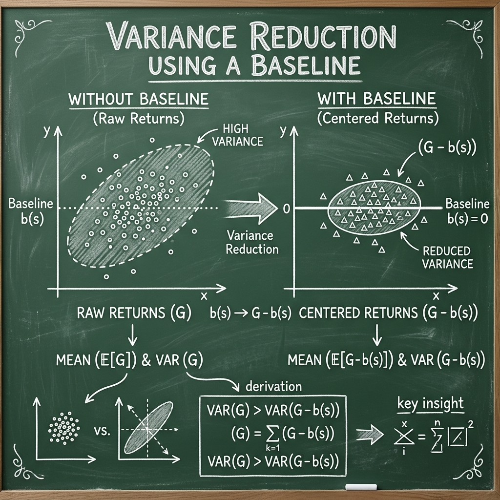
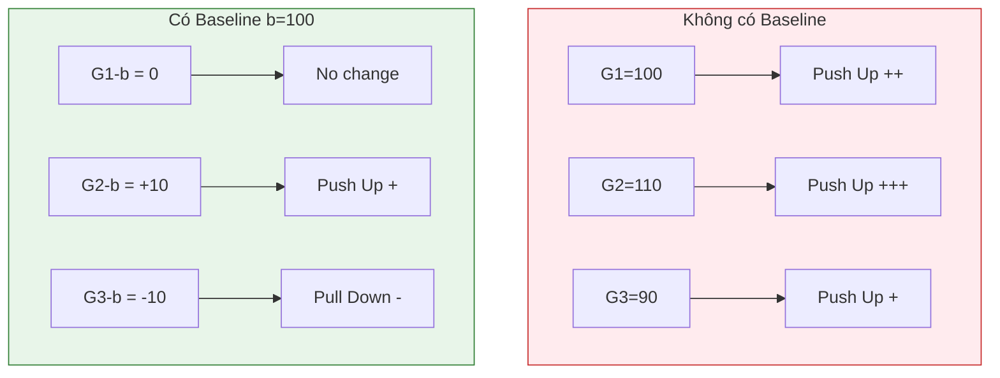

# Baseline và Kỹ thuật Giảm phương sai (Variance Reduction)

Thuật toán REINFORCE cơ bản có một nhược điểm chí mạng: **Phương sai cực cao**. Điều này khiến quá trình huấn luyện không ổn định và Agent có thể "quên" những gì đã học (hiện tượng "dip" mà chúng ta quan sát được ở tập 600).

## 1. Tại sao phương sai lại cao?

Trong công thức Gradient:
$$\nabla_\theta J(\theta) = \mathbb{E} [\sum \nabla \ln \pi G_t]$$

Giá trị $G_t$ có thể dao động rất lớn giữa các episode khác nhau, ngay cả khi Agent thực hiện cùng một hành động tốt. Ví dụ:

- Episode A: Agent may mắn gặp trạng thái dễ, $G_t = 500$.
- Episode B: Môi trường biến động khó, $G_t = 50$.

Sự chênh lệch này khiến vector Gradient bị "giật" mạnh, làm mất ổn định trọng số mạng neural.

## 2. Tại sao Baseline lại hoạt động?

Vấn đề của REINFORCE thuần túy là $G_t$ có thể rất lớn và luôn dương (trong các môi trường như CartPole, phần thưởng luôn $\ge 0$). Điều này dẫn đến việc mọi hành động đều được "đẩy" lên, chỉ là đẩy nhiều hay ít. Điều này làm cho việc học rất chậm và không ổn định.



Bằng cách trừ đi một giá trị trung bình (Baseline), chúng ta "căn giữa" các cập nhật. Những hành động tốt hơn trung bình sẽ có $(G_t - b) > 0$ (được đẩy lên), và những hành động kém hơn trung bình sẽ có $(G_t - b) < 0$ (bị kéo xuống).

### Sơ đồ Trực quan hóa Baseline (Centering Updates)



_Nhận xét:_ Khi không có Baseline, mọi hành động đều được khuyến khích (màu đỏ), dẫn đến việc mạng neural khó phân biệt cái nào thực sự nổi bật. Khi có Baseline (màu xanh), sự khác biệt được làm rõ nét: Cái tốt được tăng, cái kém bị giảm.

## 3. Baseline tối ưu (Optimal Constant Baseline)

Dù bất kỳ $b$ nào không phụ thuộc vào $a_t$ cũng không làm chệch gradient, nhưng có một giá trị $b^*$ giúp giảm phương sai nhiều nhất.

Xét phương sai của gradient ước lượng $g(\theta) = \nabla_\theta \ln \pi(a|s) (G - b)$. Để tối thiểu hóa $Var(g)$, ta đạo hàm theo $b$ và cho bằng 0:

$$b^* = \frac{\mathbb{E} [\|\nabla_\theta \ln \pi(a|s)\|^2 G]}{\mathbb{E} [\|\nabla_\theta \ln \pi(a|s)\|^2]}$$

Đây là trung bình có trọng số của phần thưởng $G$, trong đó trọng số là độ lớn của gradient. Trong thực tế, chúng ta thường dùng:

1.  **Moving Average:** Trung bình động của các $G$ đã nhận.
2.  **Value Function $V(s)$:** Đây là cách tiếp cận của Actor-Critic, dùng một mạng neural khác để dự đoán $b(s)$.

## 4. Kỹ thuật Baseline Subtraction

Chúng ta có thể trừ đi một giá trị $b(s_t)$ (gọi là Baseline) khỏi $G_t$ mà không làm thay đổi kỳ vọng của Gradient:

$$\nabla_\theta J(\theta) = \mathbb{E} \left[ \sum_{t=0}^{T} \nabla_\theta \ln \pi_\theta(a_t | s_t) (G_t - b(s_t)) \right]$$

### Chứng minh tính bất biến của kỳ vọng:

Để công thức trên đúng, ta cần chứng minh:
$$\mathbb{E} [\nabla_\theta \ln \pi_\theta(a_t | s_t) b(s_t)] = 0$$

Ta có:
$$\mathbb{E}_{a \sim \pi} [\nabla_\theta \ln \pi_\theta(a|s) b(s)] = \sum_{a} \pi_\theta(a|s) \nabla_\theta \ln \pi_\theta(a|s) b(s)$$
Sử dụng Log-derivative trick ngược lại:
$$= \sum_{a} \nabla_\theta \pi_\theta(a|s) b(s) = b(s) \nabla_\theta \sum_{a} \pi_\theta(a|s)$$
Vì $\sum_{a} \pi_\theta(a|s) = 1$ (tổng xác suất luôn bằng 1), nên đạo hàm của nó bằng 0:
$$= b(s) \nabla_\theta (1) = b(s) \cdot 0 = 0$$

## 3. Lựa chọn Baseline trong thực tế

Mục tiêu của Baseline là làm cho $G_t - b(s_t)$ có giá trị nhỏ hơn và ổn định hơn. Các lựa chọn phổ biến:

1.  **Hàm giá trị (Value Function):** $b(s_t) = V(s_t)$. Đây là cách tốt nhất (dẫn đến thuật toán Actor-Critic).
2.  **Trung bình Return:** $b = \frac{1}{N} \sum G_t$.
3.  **Standardization (Chuẩn hóa):** Trong code của chúng ta, chúng ta sử dụng:
    $$b = \text{mean}(G), \quad \text{Scale by } \text{std}(G)$$
    Công thức thực tế trong code: 
    ```python
    returns = torch.tensor(returns, dtype=torch.float32).to(device)
    if len(returns) > 1:
        returns = (returns - returns.mean()) / (returns.std() + 1e-8)
    ```

## 4. Kết quả của việc giảm phương sai

- **Ổn định:** Gradient chỉ hướng về việc "tốt hơn trung bình" hoặc "tệ hơn trung bình".
- **Hội tụ nhanh hơn:** Mạng neural không bị nhiễu bởi các giá trị Reward tuyệt đối quá lớn.
- **Giải thích hiện tượng tập 600:** Nếu không có Baseline tốt hoặc kích thước batch quá nhỏ, phương sai tích lũy có thể khiến Gradient rơi vào vùng bão hòa hoặc đi ngược hướng, gây ra hiện tượng giảm hiệu suất đột ngột.
