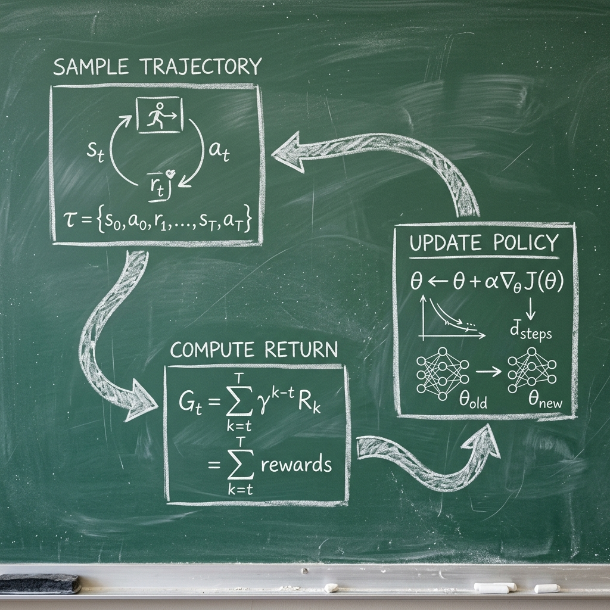

# Ánh xạ 1:1 giữa Toán học và Mã nguồn

Để giúp team dễ dàng đối chiếu, bảng dưới đây ánh xạ các thành phần trong công thức toán học của thuật toán REINFORCE vào các biến số và hàm số thực tế trong mã nguồn dự án.

## 1. Bảng đối chiếu Ký hiệu (Symbol Mapping)

| Ký hiệu | Ý nghĩa | Biến trong Code | Vị trí (File) |
| :--- | :--- | :--- | :--- |
| $s$ | Trạng thái (State) | `state` | `sources/train.py` |
| $a$ | Hành động (Action) | `action` | `sources/train.py` |
| $\pi_\theta(a \mid s)$ | Chính sách (Policy) | `probs` hoặc `action_probs` | `sources/models/policy.py` |
| $\ln \pi_\theta(a \mid s)$ | Log-policy | `log_prob` | `sources/models/policy.py` |
| $r_t$ | Phần thưởng tức thời | `reward` | `sources/train.py` |
| $G_t$ | Tổng phần thưởng | `returns` hoặc `G` | `sources/reinforce.py` |
| $\gamma$ | Hệ số chiết khấu | `gamma` | Tham số của `train_reinforce` |
| $\alpha$ | Learning rate | `lr` | Tham số của `train_reinforce` |
| $\nabla_\theta J(\theta)$ | Gradient | `policy_loss.backward()` | `sources/reinforce.py` |

## 2. Sơ đồ Luồng Công việc (REINFORCE Workflow)

Dưới đây là chu trình từ khi Agent quan sát môi trường cho đến khi cập nhật tham số:



## 3. Luồng dữ liệu (Data Flow)

### Bước 1: Thu thập Trajectory (Sampling)

Trong `train.py`, vòng lặp `while not (done or truncated)` thực hiện việc lấy mẫu:

```python
action, log_prob = policy_net.select_action(state, device)
next_state, reward, done, truncated, _ = env.step(action)
log_probs.append(log_prob)
rewards.append(reward)
```

- Tương ứng với việc lấy mẫu $\tau \sim \pi_\theta$.

### Bước 2: Từ $R(\tau)$ đến Reward-to-go ($G_t$)

```python
# Trong sources/train.py
returns = compute_returns(rewards, gamma)
# Trong sources/reinforce.py
returns = torch.tensor(returns, dtype=torch.float32).to(device)
if len(returns) > 1:
    returns = (returns - returns.mean()) / (returns.std() + 1e-8)
```

- Tương ứng với việc áp dụng Baseline $b = \text{mean}(G)$ và chuẩn hóa phương sai.

### Bước 3: Tính Loss và Backward
Trong `sources/reinforce.py`, hàm `update_policy` thực hiện:
```python
policy_loss = []
for log_prob, G_t in zip(log_probs, returns):
    policy_loss.append(-log_prob * G_t)
policy_loss = torch.stack(policy_loss).sum()
```

### Bước 4: Cập nhật Trọng số (Weight Update)
```python
optimizer.zero_grad()
policy_loss.backward()
optimizer.step()
```

## 4. Tại sao cấu trúc code lại như vậy?

1.  **Lưu trữ `log_probs`:** Chúng ta phải lưu lại `log_prob` tại mỗi bước vì đó là một phần của đồ thị tính toán (computational graph). Nếu không lưu, PyTorch sẽ không biết cách tính đạo hàm ngược lại các trọng số mạng neural đã sinh ra xác suất đó.
2.  **Tính `returns` ngược:** Tính ngược từ dưới lên (từ $T$ về $0$) hiệu quả hơn về mặt tính toán ($O(T)$ thay vì $O(T^2)$).
3.  **Xóa bộ nhớ:** Ở đầu mỗi episode, chúng ta khởi tạo lại danh sách `rewards = []` và `log_probs = []`. Điều này tương ứng với việc chúng ta đang thực hiện On-policy learning (học dựa trên dữ liệu mới nhất).
