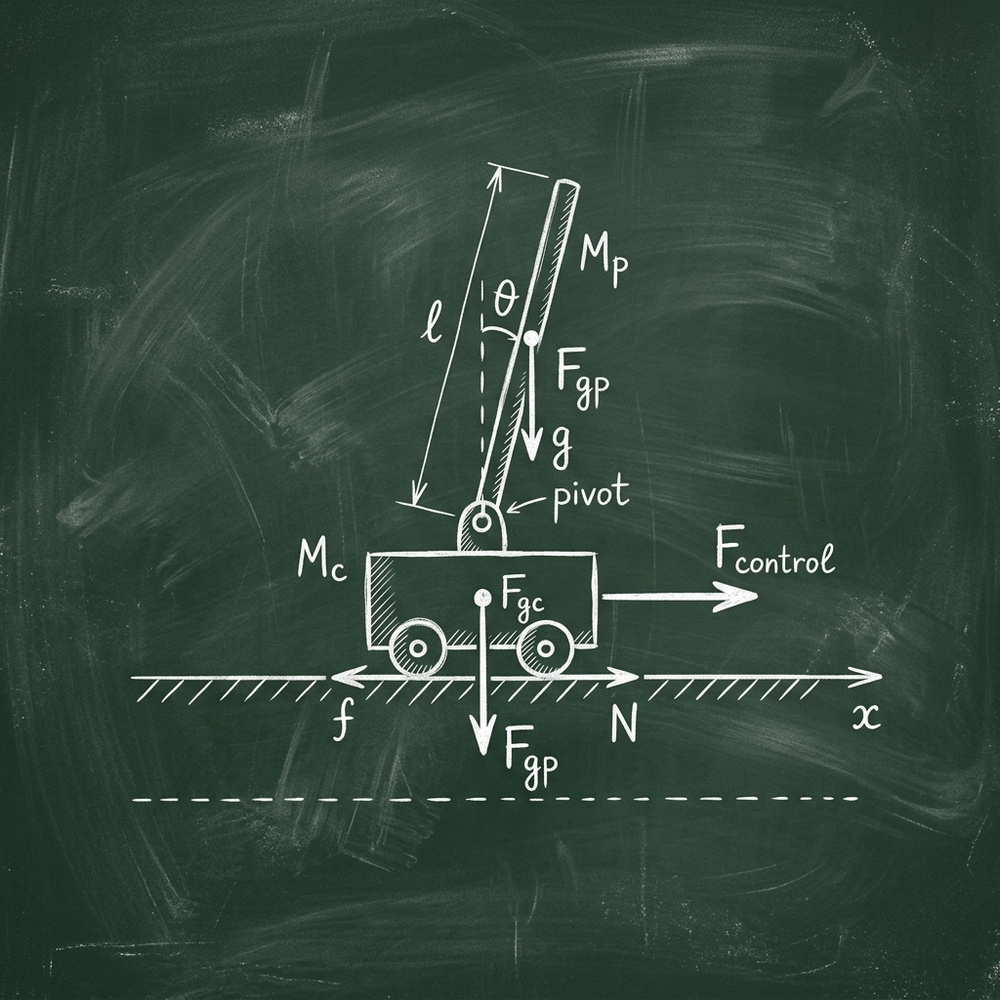

# Case Study: Phân tích hội tụ trên môi trường CartPole-v1



Tài liệu này sử dụng các khái niệm toán học đã thiết lập để giải thích các hiện tượng thực tế quan sát được trong quá trình huấn luyện Agent trên môi trường CartPole-v1 của dự án Team 05.

## 1. Phân tích Biểu đồ Hội tụ (Training Curve)

Trong quá trình chạy thực tế, chúng ta quan sát thấy biểu đồ phần thưởng (Reward) có xu hướng tăng dần nhưng không ổn định tuyệt đối. Có những giai đoạn Agent đạt được mức tối đa (500 điểm) nhưng ngay sau đó lại bị sụt giảm đột ngột.

### Hiện tượng "Cú Dip" tại Episode 600
Một hiện tượng tiêu biểu trong báo cáo của team là sự sụt giảm hiệu suất (performance drop) tại khoảng tập phim thứ 600. Dưới góc nhìn toán học, điều này có thể giải thích qua 2 nguyên nhân cốt lõi:

1.  **High Variance (Phương sai cao):**
    *   Mặc dù chúng ta đã sử dụng Reward Standardization, nhưng REINFORCE bản chất vẫn là một thuật toán "nhạy cảm". Một chuỗi các hành động ngẫu nhiên tệ (do tính stochastic của policy) có thể dẫn đến một vector Gradient cực lớn đẩy các trọng số mạng neural ra khỏi vùng tối ưu cục bộ mà nó vừa tìm thấy.
2.  **Catastrophic Forgetting (Quên thảm khốc):**
    *   Trong RL, dữ liệu huấn luyện do chính Agent tạo ra. Khi Agent trở nên quá tốt, nó chỉ khám phá một vùng không gian trạng thái hẹp. Nếu đột ngột gặp phải một trạng thái lạ và xử lý sai, các mẫu dữ liệu "tệ" này sẽ thống trị batch huấn luyện hiện tại, khiến mạng neural cập nhật theo hướng sai lầm và "quên" mất cách xử lý các trạng thái thông thường.

## 2. Ảnh hưởng của Hyperparameters

### Hệ số chiết khấu ($\gamma = 0.99$)
*   **Toán học:** $\gamma$ quyết định "tầm nhìn" của Agent. Với $\gamma = 0.99$, Agent quan tâm đến phần thưởng ở rất xa trong tương lai.
*   **Thực tế:** Nếu $\gamma$ quá nhỏ (ví dụ 0.5), Agent sẽ trở nên "thiển cận", nó chỉ cố gắng không làm đổ thanh gỗ trong 1-2 bước tới mà không quan tâm đến việc giữ thăng bằng lâu dài. Trong CartPole, việc duy trì sự ổn định yêu cầu một tầm nhìn dài hạn, do đó $\gamma$ cao là bắt buộc.

### Learning Rate ($\alpha = 0.001$)
*   **Toán học:** Quyết định kích thước bước nhảy trong Gradient Ascent.
*   **Thực tế:** Nếu LR quá lớn, Agent sẽ học rất nhanh nhưng dễ bị dao động mạnh và không bao giờ hội tụ (bước nhảy quá dài làm vọt qua đỉnh núi). Nếu LR quá nhỏ, quá trình huấn luyện sẽ cực kỳ chậm và có thể kẹt ở các điểm cực tiểu địa phương.

## 3. Vai trò của Chuẩn hóa (Normalization)

Trong code, chúng ta thực hiện:
```python
returns = (returns - returns.mean()) / (returns.std() + 1e-8)
```
Việc này chuyển đổi bài toán từ "tối đa hóa phần thưởng tuyệt đối" sang "tối đa hóa phần thưởng tương đối so với trung bình của chính nó".
*   Nếu một ván chơi đạt 500 điểm nhưng trung bình gần đây cũng là 500, thì `return` sau chuẩn hóa sẽ xấp xỉ 0. Điều này ngăn chặn việc mạng neural bị cập nhật quá mức khi đã đạt đến trạng thái bão hòa, giúp duy trì sự ổn định ở giai đoạn cuối quá trình huấn luyện.

## 4. Kết luận từ thực nghiệm

Kết quả huấn luyện cho thấy thuật toán REINFORCE của Team 05 đã thực thi đúng các nguyên lý toán học. Hiện tượng dao động là một đặc tính tự nhiên của thuật toán này. Để đạt được sự ổn định cao hơn, các nghiên cứu tiếp theo có thể áp dụng các biến thể như **Actor-Critic** (sử dụng thêm mạng thứ hai để dự đoán Baseline một cách chính xác hơn cho từng trạng thái).
