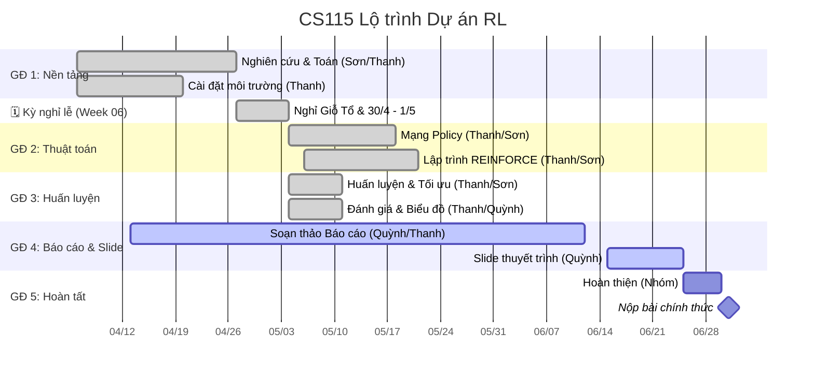

# Lộ trình Dự án

Dưới đây là lịch trình làm việc và lộ trình phát triển chính cho CS115-Team05, bám sát theo kế hoạch song song hóa. Tính đến Tuần 07, nhánh công việc Code đã được làm trước tiến độ để dành thời gian cho toán, báo cáo, demo và đóng gói cuối kỳ.

## 🗺️ Lộ trình tổng thể (Biểu đồ Gantt)

---

## 📈 Theo dõi Tiến độ

> **Nguồn chính thống:** `reports/weekly_updates/week-0{3,4,5}.md` — chi tiết theo từng người tại `reports/detailed_reports/`. Quy tắc cập nhật thư mục báo cáo xem tại [`reports/README.md`](../reports/README.md).
>
> | Tuần | Giai đoạn   | Trạng thái                                                                |
> | :--- | :---------- | :------------------------------------------------------------------------ |
> | W03  | 06/04–12/04 | ✅ Hoàn thành — Khởi động, Charter, WBS                                   |
> | W04  | 13/04–19/04 | ✅ Hoàn thành — Bản nháp chứng minh PG, Mạng Policy, Logic REINFORCE      |
> | W05  | 20/04–26/04 | ✅ Hoàn thành — Đóng Milestone 1, code cốt lõi chạy được trên CartPole-v1 |
> | W06  | 27/04–03/05 | ✅ Hoàn thành — Nghỉ lễ theo kế hoạch, không giao thêm task nặng          |
> | W07  | 04/05–10/05 | ✅ Code đi trước tiến độ — CODE-05..08 hoàn thành, tiếp tục toán/báo cáo  |

## ✅ Mốc đã hoàn thành tính đến Tuần 07

| Nhóm việc             | Mốc                                                                 | Trạng thái             | Bằng chứng chính                                                                          |
| :-------------------- | :------------------------------------------------------------------ | :--------------------- | :---------------------------------------------------------------------------------------- |
| Nền tảng              | Setup Python, PyTorch, Gymnasium; random baseline                   | ✅ Hoàn thành          | `requirements.txt`, `sources/test_env.py`, `outputs/baseline_20260507_092018/`            |
| Thuật toán            | Policy MLP và REINFORCE core                                        | ✅ Hoàn thành          | `sources/models/policy.py`, `sources/reinforce.py`, `sources/train.py`                    |
| Reproducibility       | Entrypoint train/evaluate, seed, hidden_dim, output logs            | ✅ Hoàn thành          | `scripts/train.py`, `scripts/evaluate.py`, `rewards.txt`, `run_config.txt`, `metrics.txt` |
| Hyperparameter tuning | Grid nhỏ, ranking theo mean last-50/std/best reward                 | ✅ Hoàn thành          | `scripts/run_experiments.py`, `outputs/experiments/`                                      |
| Visualization         | Figure report-ready, baseline vs trained, HP comparison             | ✅ Hoàn thành          | `scripts/visualize.py`, `outputs/figures/`                                                |
| Logic explanation     | Tài liệu giải trình code, PR #40 coi như đã merge vào `origin/main` | ✅ Hoàn thành kỹ thuật | `docs/`, PR #40, issue #11                                                                |

## 🔄 Trọng tâm còn lại

1. **Toán & báo cáo**: hoàn thiện mạch chứng minh, giải thích trực quan và đưa vào report Word.
2. **Kết quả cuối kỳ**: chọn final run, final evaluation, figure cuối và demo package.
3. **Human quality gates**: walkthrough/Q&A và xác nhận leader nếu ticket yêu cầu bằng chứng người thật.
4. **Submission prep**: slide, demo, video hoặc gói nộp theo deadline 01/07/2026.

---

## 🏗️ Phân chia Công việc chi tiết (WBS - Phân rã Công việc)

| Phân hệ     | Nội dung                                             | Người phụ trách    | Hỗ trợ         |
| :---------- | :--------------------------------------------------- | :----------------- | :------------- |
| **Toán**    | Chứng minh PG, Thủ thuật log-đạo hàm, LaTeX          | Hoàng Cao Sơn      | Đặng Chí Thanh |
| **Code**    | Môi trường Gymnasium, Mạng policy PyTorch, REINFORCE | Đặng Chí Thanh     | Hoàng Cao Sơn  |
| **Báo cáo** | Cập nhật tuần, biên bản họp, viết báo cáo            | Phạm Vũ Xuân Quỳnh | Đặng Chí Thanh |

---

## 🚩 Các cột mốc chính

1. **M1: Nền tảng (W3-W5)** — Chứng minh định lý PG + thiết lập môi trường. ✅ Hoàn thành.
2. **M2: Thuật toán (W6-W8)** — Mạng nơ-ron + triển khai REINFORCE. ✅ Hoàn thành sớm.
3. **M3: Huấn luyện (W9-W11)** — Huấn luyện, tối ưu tham số, vẽ biểu đồ. ✅ Hoàn thành sớm phần code.
4. **M4: Báo cáo (W12-W13)** — Hoàn thiện báo cáo + slide thuyết trình. 🔄 Đang tiến hành.
5. **M5: Nộp bài (W14-W15)** — Chỉnh theo góp ý GV + nộp chính thức. ⏳ Sắp tới.
