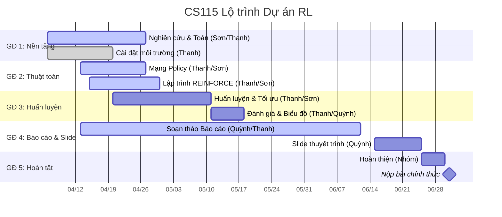

# Lộ trình Dự án (Project Roadmap)

Dưới đây là lịch trình làm việc và lộ trình phát triển chính cho CS115-Team05, bám sát theo kế hoạch song song hóa.

## 🗺️ Lộ trình tổng thể (Gantt Chart)

---

## 📈 Theo dõi Tiến độ (Weekly Tracker)

### Tuần 03 (Khởi động) — 06/04/2026

- [x] Khởi tạo repo & Git setup.
- [x] Lập kế hoạch & WBS.
- [x] Hoàn tất Team Charter v3.0.
- [x] Tạo GitHub Project board.
- [x] Nghiên cứu: REINFORCE cho không gian hành động rời rạc.
- [x] Baseline: `CartPole-v1` với hành động ngẫu nhiên.

### Tuần 04 (Mở rộng nền tảng) — 13/04/2026

- [ ] Bản nháp chứng minh PG theorem (LaTeX, `math/`).
- [ ] Giải thích Log-derivative trick.
- [x] Thiết kế Policy Network bằng PyTorch (Xong sớm).
- [x] Logic REINFORCE (Xong sớm).
- [ ] Experience buffer cho trajectory (S, A, R).
- [ ] Report: phần Introduction & Math Foundations.
- [x] Thống nhất quy trình: branch → PR → merge main.

---

## 🏗️ Phân chia Công việc chi tiết (WBS)

| Phân hệ     | Nội dung                                     | Người phụ trách | Hỗ trợ    |
| :---------- | :------------------------------------------- | :-------------- | :-------- |
| **Toán**    | Chứng minh PG, Log-derivative trick, LaTeX   | Hoàng Sơn       | Chí Thanh |
| **Code**    | Gymnasium env, PyTorch policy net, REINFORCE | Chí Thanh       | Hoàng Sơn |
| **Báo cáo** | Cập nhật tuần, biên bản họp, viết báo cáo    | Xuân Quỳnh      | Chí Thanh |

---

## 🚩 Các cột mốc chính (Milestones)

1. **M1: Nền tảng (W3-W5)** — Chứng minh PG theorem + setup môi trường.
2. **M2: Thuật toán (W6-W8)** — Mạng nơ-ron + implement REINFORCE.
3. **M3: Huấn luyện (W9-W11)** — Train, tối ưu tham số, vẽ biểu đồ (Cần song song với M2).
4. **M4: Báo cáo (W12-W13)** — Hoàn thiện report + slide thuyết trình.
5. **M5: Nộp bài (W14-W15)** — Chỉnh theo góp ý GV + nộp chính thức.
