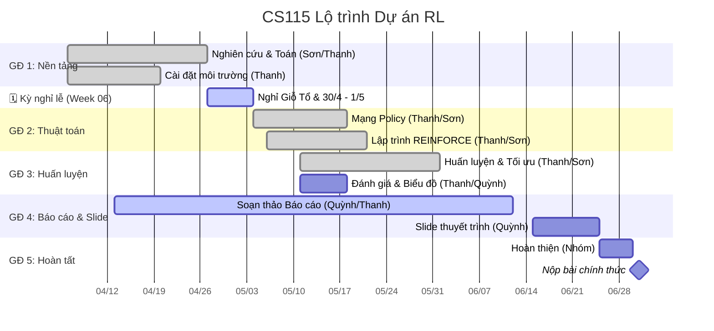

# Lộ trình Dự án

Dưới đây là lịch trình làm việc và lộ trình phát triển chính cho CS115-Team05, bám sát theo kế hoạch song song hóa.

## 🗺️ Lộ trình tổng thể (Biểu đồ Gantt)

---

## 📈 Theo dõi Tiến độ

> **Nguồn chính thống:** `reports/weekly_updates/week-0{3,4,5}.md` — chi tiết theo từng người tại `reports/detailed_reports/`.
>
> | Tuần | Giai đoạn   | Trạng thái                                                                |
> | :--- | :---------- | :------------------------------------------------------------------------ |
> | W03  | 06/04–12/04 | ✅ Hoàn thành — Khởi động, Charter, WBS                                   |
> | W04  | 13/04–19/04 | ✅ Hoàn thành — Bản nháp chứng minh PG, Mạng Policy, Logic REINFORCE      |
> | W05  | 20/04–26/04 | 🔄 Đang đóng — Code cốt lõi hoàn thành sớm, báo cáo & toán đang tiến hành |

---

## 🏗️ Phân chia Công việc chi tiết (WBS - Phân rã Công việc)

| Phân hệ     | Nội dung                                             | Người phụ trách    | Hỗ trợ         |
| :---------- | :--------------------------------------------------- | :----------------- | :------------- |
| **Toán**    | Chứng minh PG, Thủ thuật log-đạo hàm, LaTeX          | Hoàng Cao Sơn      | Đặng Chí Thanh |
| **Code**    | Môi trường Gymnasium, Mạng policy PyTorch, REINFORCE | Đặng Chí Thanh     | Hoàng Cao Sơn  |
| **Báo cáo** | Cập nhật tuần, biên bản họp, viết báo cáo            | Phạm Vũ Xuân Quỳnh | Đặng Chí Thanh |

---

## 🚩 Các cột mốc chính

1. **M1: Nền tảng (W3-W5)** — Chứng minh định lý PG + thiết lập môi trường.
2. **M2: Thuật toán (W6-W8)** — Mạng nơ-ron + triển khai REINFORCE.
3. **M3: Huấn luyện (W9-W11)** — Huấn luyện, tối ưu tham số, vẽ biểu đồ (Cần song song với M2).
4. **M4: Báo cáo (W12-W13)** — Hoàn thiện báo cáo + slide thuyết trình.
5. **M5: Nộp bài (W14-W15)** — Chỉnh theo góp ý GV + nộp chính thức.
