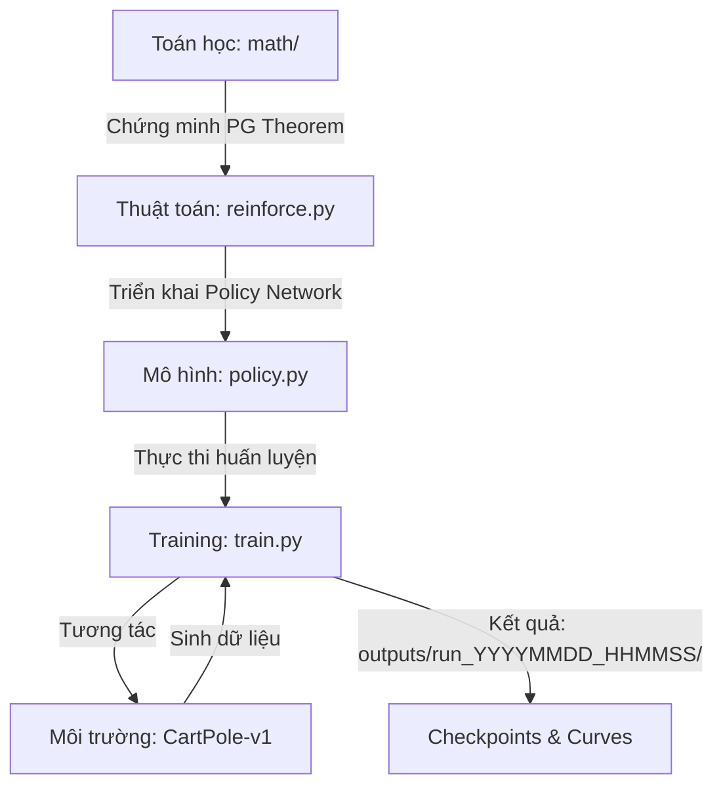

# 🏗️ Kiến trúc Hệ thống (System Architecture)

Tài liệu này giải thích luồng logic của dự án Team 05: Từ các công thức Toán học đến mã nguồn thực thi và kết quả cuối cùng.

## 🔗 Liên kết nhanh

- **Cập nhật hàng tuần**: [`reports/weekly_updates/`](../reports/weekly_updates/)
- **Hồ sơ dự án (PDR)**: [`docs/project-overview-pdr.md`](./project-overview-pdr.md)
- **Lộ trình chi tiết**: [`docs/project-roadmap.md`](./project-roadmap.md)

## 1. Luồng Logic Tổng thể (Math-to-Code Pipeline)

Dự án được xây dựng theo mô hình "Toán học dẫn dắt Lập trình":

### Tại sao cần chứng minh toán học trước?

1. **Đảm bảo tính đúng đắn**: Thuật toán REINFORCE dựa trên Gradient Ascent. Việc hiểu rõ $\nabla_{\theta} J(\theta)$ giúp chúng ta biết chính xác tại sao phải dùng Log-derivative trick trong code.
2. **Đối chiếu (Verification)**: Giúp việc gỡ lỗi (debug) dễ dàng hơn khi các ký hiệu trong code ($\pi, G_{t}, \theta$) khớp hoàn toàn với lý thuyết.

## 2. Các thành phần chính

### A. Core Algorithm (`sources/reinforce.py`)

Triển khai công thức cập nhật: $\theta \leftarrow \theta + \alpha G_{t} \nabla_{\theta} \ln \pi(A_{t}|S_{t})$.

- **Discounted Returns**: Tính toán tổng phần thưởng từ cuối tập (episode) về đầu để tối ưu $O(T)$.
- **Baseline**: Sử dụng chuẩn hóa (normalization) cho $G_t$ để giảm phương sai (variance), giúp Agent học ổn định hơn.

### B. Policy Network (`sources/models/policy.py`)

- Sử dụng mạng Multi-Layer Perceptron (MLP) đơn giản.
- Output là một lớp `Softmax` tạo ra phân bố xác suất cho các hành động (Trái/Phải).
- Hàm `select_action()` sử dụng `torch.distributions.Categorical` để sample hành động, đảm bảo tính khám phá (exploration).

### C. Training Loop (`sources/train.py`)

- Quản lý tương tác với `gymnasium`.
- Thu thập dữ liệu theo từng Episode (Trajectory).
- Gọi hàm `update_policy` sau mỗi Episode.
- Lưu trữ Model Checkpoints (`.pth`) và vẽ đồ thị.

## 3. Cách thức đánh giá (Evaluation)

Chúng ta đánh giá sự thành công của hệ thống dựa trên:

1. **Đường cong hội tụ**: Reward trung bình tăng dần và tiệm cận mức tối đa (500 cho CartPole-v1).
2. **Độ ổn định**: Sau khi "giải" được bài toán, Agent không bị sụt giảm hiệu suất đột ngột.

---

## 🤖 Hướng dẫn cho AI Agents

- Khi chỉnh sửa `reinforce.py`, hãy đảm bảo các biến `log_probs` và `returns` luôn được xử lý dưới dạng Tensor để tận dụng Autograd.
- Tuyệt đối không thay đổi cấu trúc mạng trong `policy.py` mà không cập nhật lại tài liệu này.
